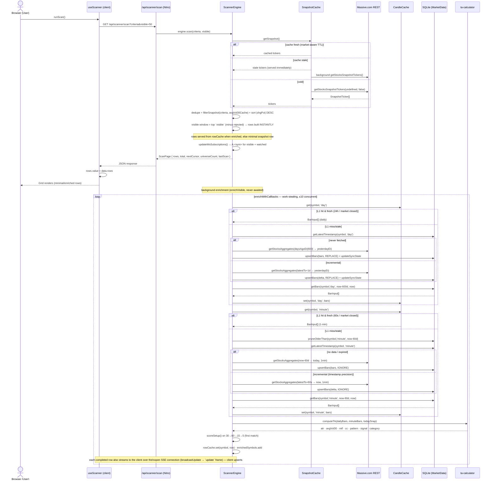
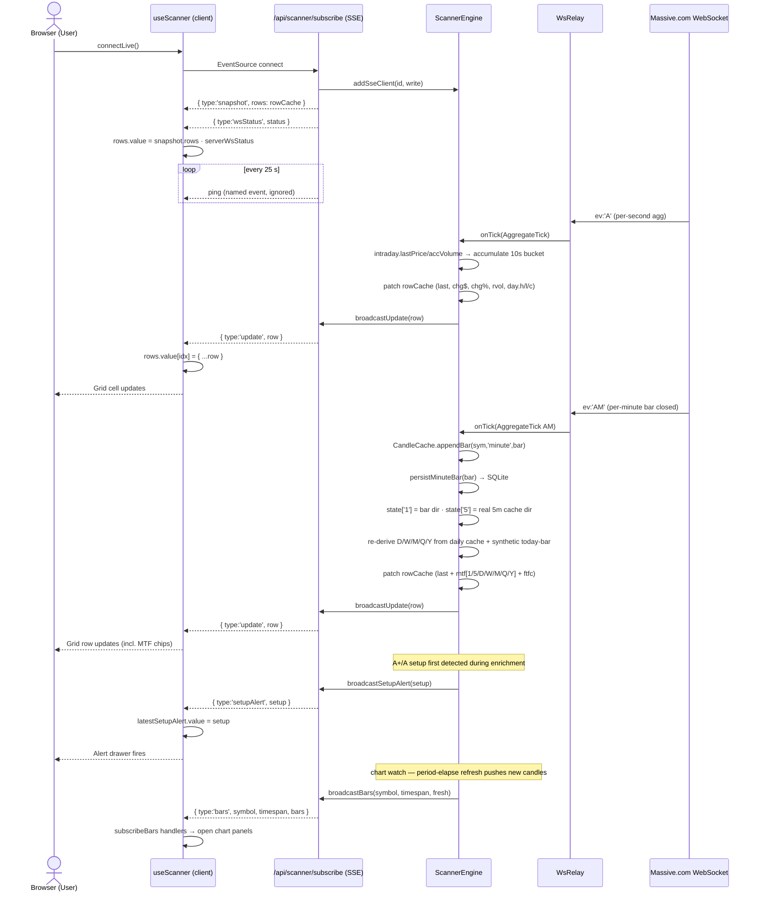
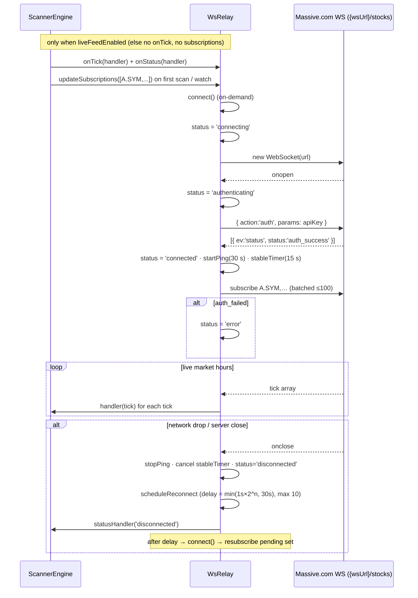

# Data Architecture — Pulse Trader

> **Authoritative reference for the data layer.** Every claim below was verified against the source code
> and the live SQLite database on **2026-08-19**. This document is the single source of truth to reference
> when refactoring the historical + live data mechanisms. It supersedes all previous architecture docs.
>
> Covered: external provider contract, SQLite schema + real DB state, the L1/L2/L3 cache stack, historical
> ingestion paths, the live WebSocket pipeline, SSE fan-out, client-side state, complete flow diagrams, and
> a verified list of gaps with refactor-targeted remediation notes.

---

## Table of Contents

1. [Overview & Philosophy](#1-overview--philosophy)
2. [External Data Source — Massive.com (Polygon-compatible)](#2-external-data-source--massivecom-polygon-compatible)
3. [Persistence Layer — SQLite](#3-persistence-layer--sqlite)
   - 3.1 [Schema](#31-schema)
   - 3.2 [Verified DB state (2026-08-19)](#32-verified-db-state-2026-08-19)
   - 3.3 [ConnectionManager & Repository](#33-connectionmanager--repository)
4. [Server-Side Caching Layers](#4-server-side-caching-layers)
   - 4.1 [SnapshotCache](#41-snapshotcache)
   - 4.2 [CandleCache](#42-candlecache)
5. [Data Ingestion Paths](#5-data-ingestion-paths)
   - 5.1 [Daily Bars (L1→L2→L3)](#51-daily-bars-l1l2l3)
   - 5.2 [1-Minute Bars (L1→L2→L3, Rolling Window)](#52-1-minute-bars-l1l2l3-rolling-window)
   - 5.3 [5-Minute Bars (Real Series, L1→L2→L3)](#53-5-minute-bars-real-series-l1l2l3)
   - 5.4 [10-Second Bars (WS Buckets + REST Seed)](#54-10-second-bars-ws-buckets--rest-seed)
   - 5.5 [Derived Timeframes (In-Memory)](#55-derived-timeframes-in-memory)
   - 5.6 [Manual Bulk Sync](#56-manual-bulk-sync)
6. [Scanner Engine — The Orchestrator](#6-scanner-engine--the-orchestrator)
   - 6.1 [Scan Pipeline](#61-scan-pipeline)
   - 6.2 [Row Cache](#62-row-cache)
   - 6.3 [Intraday State Map](#63-intraday-state-map)
   - 6.4 [Chart Watch & Period Refresh](#64-chart-watch--period-refresh)
   - 6.5 [Live Feed Gate](#65-live-feed-gate)
7. [Live Data — WebSocket Relay](#7-live-data--websocket-relay)
   - 7.1 [Connection Lifecycle & Reconnect](#71-connection-lifecycle--reconnect)
   - 7.2 [Subscriptions (A-only)](#72-subscriptions-a-only)
   - 7.3 [Tick Processing](#73-tick-processing)
8. [Server → Client Push — SSE](#8-server--client-push--sse)
9. [API Endpoints Summary](#9-api-endpoints-summary)
10. [Client-Side State Management](#10-client-side-state-management)
11. [Settings & Credential Handling](#11-settings--credential-handling)
12. [TA Computation](#12-ta-computation)
13. [Complete Data Flow Diagrams](#13-complete-data-flow-diagrams)
    - 13.1 [ASCII Overview](#131-ascii-overview)
    - 13.2 [Mermaid Flowchart](#132-mermaid-flowchart)
14. [Sequence Diagrams](#14-sequence-diagrams)
    - 14.1 [Scan Request — Two-Phase Path](#141-scan-request--two-phase-path)
    - 14.2 [SSE Connection & Live Tick Update](#142-sse-connection--live-tick-update)
    - 14.3 [WebSocket Relay Lifecycle](#143-websocket-relay-lifecycle)
15. [Known Gaps, Risks & Refactor Targets](#15-known-gaps-risks--refactor-targets)

---

## 1. Overview & Philosophy

Pulse Trader is a **layered, cache-first** trading journal + "The Strat" scanner. All market data originates
from **Massive.com** and is read through three progressively slower layers:

```
L1  In-Memory (CandleCache)      — sub-millisecond, per-process singleton (globalThis)
L2  SQLite (MarketData table)    — millisecond reads, persistent across restarts
L3  Massive.com REST API         — network I/O, rate-limited, authoritative source
```

The scanner always tries L1 first, falls back to L2 (with an incremental delta), and only hits L3 when the
local store is empty or stale. **Live prices bypass this stack entirely** — they arrive over a single
WebSocket connection and are patched directly into the in-memory row cache, then fan out to connected
browsers via SSE.

All server-side singletons hang off `globalThis` so they survive Nitro hot-reload in dev:

| Singleton | File | Scope |
|---|---|---|
| `connectionManager` (module-level) | `src/server/database/connection-manager.ts` | SQLite connection |
| `__snapshotCache` | `src/server/services/snapshot-cache.ts` | Full-market snapshot |
| `__candleCache` | `src/server/services/candle-cache.ts` | In-memory OHLCV store (L1) |
| `__wsRelay` | `src/server/services/ws-relay.ts` | Upstream WebSocket relay |
| `__scannerEngine` | `src/server/services/scanner-engine.ts` | Orchestrator + row cache + SSE |
| `__metrics` | `src/server/services/metrics.ts` | In-memory counters for the data layer |

---

## 2. External Data Source — Massive.com (Polygon-compatible)

All market data originates from **Massive.com** via `@massive.com/client-js` (`^10.5.0`). The SDK is an
auto-generated **Polygon API** client (Polygon OpenAPI spec rebranded for Massive). The app talks to it
directly via `restClient(apiKey, apiUrl)`; the WebSocket is **hand-rolled** (`ws-relay.ts`) and does not
use the SDK's WS client.

| Data type | Endpoint / SDK method | Cadence |
|---|---|---|
| Full-market snapshot | `getStocksSnapshotTickers(undefined, false)` → `GET /v2/snapshot/locale/us/markets/stocks/tickers` | On-demand, cached (market-aware TTL, SWR) |
| Aggregate bars (daily) | `getStocksAggregates(...)` → `GET /v2/aggs/ticker/{t}/range/{mult}/{span}/{from}/{to}` | Per scan / chart (incremental delta) |
| Aggregate bars (1-min) | `getStocksAggregates(...)` | Per scan (rolling 60-day window) |
| Aggregate bars (5-min) | `getStocksAggregates(...)` | Per period-elapse (rolling 60-day window) |
| Aggregate bars (10-second) | `getStocksAggregates(...)` (`multiplier=10, timespan='second'`) | Cold-seed only (~70-min lookback) |
| Ticker search | `listTickers({ search })` → `GET /v3/reference/tickers` | On-demand |
| Live feed | Raw WS → `{wsUrl}/stocks` | Continuous (single connection) |

**Aggregate request params** (`market-data.service.ts:190`): `stocksTicker`, `multiplier`, `timespan`,
`from`, `to`, `adjusted: 'true'`, `sort: 'asc'`, `limit: '50000'`.

**Pagination** (`fetchAggregates`, `market-data.service.ts:170`): follows `next_url` cursors via raw
`fetch()`, appending pages until the date range is complete. Each page can hold up to 50,000 bars.
**Gap detection (gap E):** any page failure, an empty page with a pending `next_url`, or a short-fall vs
the API's claimed `resultsCount` **THROWS** — a partial result is never silently upserted as complete.

**Response envelope** (`market-data.service.ts:38-59`): the SDK returns bars under `response.results` (or
`response.data.results`); `status === 'OK'` indicates success. Bar fields `t/o/h/l/c/v/n` map to `BarInput`.

### WebSocket protocol (hand-rolled)

- URL: `{wsUrl}/stocks` — `wsUrl` from settings (`data-broker-details`), default `wss://delayed.massive.com`
- Auth frame: `{ "action": "auth", "params": "<apiKey>" }`
- Server replies `[{ "ev": "status", "status": "auth_success" }]`
- Subscribe: `{ "action": "subscribe", "params": "A.AAPL,A.MSFT" }` (comma-separated, batched ≤100)
- Unsubscribe: `{ "action": "unsubscribe", "params": "..." }`
- Keep-alive: `{ "action": "ping" }` every 30 s
- Inbound frames are JSON arrays; event types: `A` (per-second aggregate), `AM` (per-minute aggregate),
  `T` (trade), `status`. `Q` (quote) is **not subscribed** (see §7.2 / §15-K).

---

## 3. Persistence Layer — SQLite

**File:** `data/pulse-trader.db` · **Driver:** `better-sqlite3` (synchronous API) · **Mode:** WAL
(`connection-manager.ts:55`) — concurrent reads during writes. DB path resolution:
`runtimeConfig.dbPath` → `DB_PATH` env → existing `data/pulse-trader.db` near cwd (production-proofed
against the `.output` chdir, `connection-manager.ts:16`).

### 3.1 Schema

Tables present in the live DB: `MarketData`, `MarketDataSyncState`, `Settings`, `MigrationHistory`,
`ResearchExperiment`, `ResearchProject`, `ResearchRun` (the last three are **orphaned** — see §15-G).

**MarketData** (migration `20260326000000_create-market-data.ts`):

```sql
CREATE TABLE MarketData (
  Id           TEXT PRIMARY KEY,
  Ticker       TEXT NOT NULL,
  Timespan     TEXT NOT NULL,    -- 'day' | 'minute' | '5min' | '10s'
  Timestamp    INTEGER NOT NULL, -- Unix ms
  Open         REAL NOT NULL,
  High         REAL NOT NULL,
  Low          REAL NOT NULL,
  Close        REAL NOT NULL,
  Volume       INTEGER NOT NULL,
  Transactions INTEGER,
  CreatedAt    TEXT NOT NULL,
  UNIQUE(Ticker, Timespan, Timestamp)
);
CREATE INDEX idx_market_data_lookup ON MarketData(Ticker, Timespan, Timestamp);
CREATE INDEX idx_market_data_ticker ON MarketData(Ticker);
```

**MarketDataSyncState** (migration `20260817000000_create-market-data-sync-state.ts`) — the per-
`(ticker, timespan)` sync record (gap A resolved):

```sql
CREATE TABLE MarketDataSyncState (
  Ticker          TEXT    NOT NULL,
  Timespan        TEXT    NOT NULL,
  LatestTimestamp INTEGER NOT NULL DEFAULT 0,
  LastSyncAt      TEXT,
  GapStart        INTEGER,
  GapEnd          INTEGER,
  SyncError       TEXT,
  PRIMARY KEY (Ticker, Timespan)
);
```

Key behaviors:
- **Persistable timespans** (`market-data-repository.ts:50`): `upsertBars()` silently drops any bar whose
  timespan is not one of `day`, `minute`, `5min`, `10s`. Derived timeframes (15/30/60/W/M/Q/Y) are
  never written to SQLite.
- **Canonical storage timespan** (`toStoreTimespan`, `market-data.service.ts`): the API expresses
  5-minute bars as `(multiplier=5, timespan='minute')` and 10-second bars as `(multiplier=10,
  timespan='second')`; `fetchAggregates` remaps these to the app vocabulary `'5min'` / `'10s'` before
  writing. **Regression fixed 2026-08-19:** previously the raw API timespan was stamped onto stored rows,
  so 5-min bars were REPLACE-overwritten into the `minute` series (corrupting boundary bars) and 10s bars
  landed in a `second` series that the persistable filter dropped (the 10s DB seed never worked). A
  repair script (`scripts/repair-polluted-minutes.tsx`) rewrote the affected minute series from source.
- **Upsert strategy** (`market-data-repository.ts:46`): `INSERT OR REPLACE` for daily/5-min (overwrites
  stale closes), `INSERT OR IGNORE` for 1-min/10-second (avoids double-insert). `Id` is a fresh
  `randomUUID()` per insert. `data-manager` CRUD uses `REPLACE` on the natural key.
- **Timestamp semantics:** daily bars use session-midnight in UTC (`04:00 UTC` = 00:00 ET) — the ET-market
  day boundary. Intraday bars (minute/5-min/10s) use the bar-start timestamp (`tick.s` / bucket start).

**Settings** (migration `20260323000000_create-settings.ts`): key/value store `(Key UNIQUE, Value, Type)`
seeded by `20260323100000_seed-default-settings.ts` (incl. `data-broker-details` JSON) and
`20260327100000_seed-llm-settings.ts`.

### 3.2 Verified DB state (2026-08-19)

| Metric | Value |
|---|---|
| Total bars | **2,081,098** |
| — Daily bars | 454,290 (1,354 tickers) |
| — Minute bars | 1,611,758 (1,289 tickers) |
| — 5-min bars | 14,441 (42 tickers) |
| — 10-second bars | 609 (4 tickers) |
| Sync-state rows | 789 |
| Daily date range | 2024-09-12 → 2026-08-17 (04:00 UTC) |
| Minute date range | 2025-01-02 → 2026-08-17 15:27 UTC |
| Largest minute series | **AAPL — 193,072 bars** (~2 years — see §15-B) |
| DB file size | ~535 MB (+ WAL) |

Implications:
- The scanner's nominal "60-day rolling intraday window" is **not** reflected in the stored data — AAPL holds
  ~2 years of minutes because pruning only runs on the L1-miss path (§15-B).
- Daily data spans far longer than the 600-day read lookback; nothing ever deletes old daily rows.
- 5-min / 10-second series exist only for symbols that were chart-watched or force-refreshed
  (`chart-watch` / `chart-refresh` / `data-manager` refresh).

### 3.3 ConnectionManager & Repository

- `ConnectionManager` (`connection-manager.ts`): opens the DB once (module-level singleton), sets WAL +
  `foreign_keys = ON`, exposes `shutdown()` called by the Nitro plugin on server close
  (`plugins/database.ts`).
- `BaseRepository` (`base-repository.ts`): `executeQuery`, `executeRun`, `executeInTransaction`
  (better-sqlite3 `db.transaction`). All queries are prepared statements with named params.
- `MarketDataRepository` (`market-data-repository.ts`):
  - Bars: `upsertBars(bars, conflict='REPLACE')`, `getBars`, `getAvailableRange`, `getDataStatus`,
    `getTotalBars`, `getLatestTimestamp`, `getTimestamps`, `pruneOlderThan`, `deleteByTicker`,
    `deleteById`, `deleteByKey`, `getBarById`, `updateBarById`, `deleteAll`.
  - Sync state: `getSyncState`, `updateSyncState(latestTimestamp/gapStart/gapEnd/syncError)`,
    `clearGap`, `clearSyncState`, `deleteAllSyncStates`, `getSyncStates`.
  - Introspection: `getTableList` (for the Data Management view).

---

## 4. Server-Side Caching Layers

### 4.1 SnapshotCache

**File:** `src/server/services/snapshot-cache.ts` · **Scope:** `globalThis.__snapshotCache`

```
TTL is market-hours aware (snapshot-cache.ts:81):
  Regular hours (09:30–16:00 ET)  → 30 s
  Extended (pre/after market)      → 60 s
  Closed / weekends                → 15 min
```

The snapshot is the **universe of all US stocks** (typically 8k–15k tickers) with per-symbol:
`day` OHLCV+VWAP, `prevDay` OHLCV, `lastTrade {p,s,t}`, `min {av,c,h,l,o,v,vw,t}`, `todaysChange`,
`todaysChangePerc`, `updated`. `getSnapshotTickers(undefined, false)` returns the full universe
(excluding OTC via `include_otc=false`).

**Serving strategy — stale-while-revalidate** (`getSnapshot`, `snapshot-cache.ts:104`):
```
Fresh cache        → return immediately
Stale cache        → return stale data immediately AND refresh in the background
                     (scans never block on the network)
Cold cache         → fetch (deduplicated via an in-flight promise)
```

**Inflight deduplication** (`fetchAwait`, `snapshot-cache.ts:117`): if N scan requests hit a cold cache
simultaneously, only one outbound API call is made; the rest await the same in-flight Promise.

**Fetch timeout:** 30 s — a stalled provider call can never hang a scan (`snapshot-cache.ts:137`).

`invalidate()` clears the cache (used by the Data Management view's flush). Credentials for the snapshot
come from `getBrokerCredentials()` (`snapshot-cache.ts:54`), which decrypts `data-broker-details` fresh
on every call. `info()` exposes non-mutating state for the Data Management UI.

### 4.2 CandleCache

**File:** `src/server/services/candle-cache.ts` · **Scope:** `globalThis.__candleCache`

```
Max entries: 2,000 (key = `${ticker}:${timespan}`)
TTL per timespan (candle-cache.ts:8):
  10s   → 5 min
  5min  → 6 h
  minute→ 6 h
  hour  → 60 min
  day   → 24 h
  week  → 24 h
  month → 24 h
```

Intraday entries are long-lived because the scanner's freshness check (period elapsed vs last bar) drives
refetch — the TTL only needs to outlive a session so entries don't expire mid-day and trigger redundant
L2/L3 reads.

**Eviction policy** (`evict`, `candle-cache.ts:132`): when at capacity, expired entries are dropped first;
if still over capacity, the 200 entries with the earliest `expiresAt` are removed (approximate LRU;
O(n log n) — see §15-K).

**Real-time append** (`appendBar`, `candle-cache.ts:63`): called for every WS `AM` event. If the last
cached bar has the same timestamp it is **replaced** (in-progress bar update); otherwise it is
**appended**. If the entry is absent/expired, a new one is created containing just that bar.

**Invalidation** (`invalidate(ticker, timespan?)`) removes one series or all series for a ticker.

**Data-management helpers:** `clear()`, `size`, `totalBars`, `inspect()` (non-mutating entry view),
`peek()` (raw array without expiry check) — used by the Data Management UI.

---

## 5. Data Ingestion Paths

All paths live in `src/server/services/market-data.service.ts` and are **demand-driven** — there is no
background scheduler for market data; syncs happen when a scan, chart, or watch touches a symbol. Date
windows are derived in **US Eastern time** via `src/server/utils/et-time.ts` (gap J resolved).

**Read path never blocks on the network:** every sync function is wrapped in a per-`(ticker, timespan)`
in-flight lock (`dedupeSync`, `market-data.service.ts:27`) so concurrent scan/seed/refresh requests
share a single coherent fetch. Chart reads (`chart-bars`) are cache/DB-only and fire a **background
one-shot seed** (`scanner-engine.seedSymbolBars`) that fills missing series and pushes them to the client
over SSE — see §5.1 note and §9.

**Intraday window = 60 calendar days** (`INTRADAY_WINDOW_CALENDAR_DAYS`, `market-data.service.ts:422`):
sized for the longest chart indicator — a 200 EMA on the 60-min panel needs ~200 hourly bars
(≈ 31 trading days); 60 days (≈ 273 hourly bars) adds MACD warm-up margin. Daily lookback stays
600 calendar days.

### 5.1 Daily Bars (L1→L2→L3)

```
getDailyBars(symbol)                                (scanner-engine.ts:730)
  │
  ├─ L1: CandleCache.get(symbol, 'day')
  │      → hit AND (market closed OR series current within 24 h) → return (sub-ms)
  │
  └─ miss/stale → getOrSyncDailyBars(symbol)        (market-data.service.ts:413)
                  │
                  ├─ L2: getLatestTimestamp(symbol, 'day')
                  │
                  ├─ null (first fetch)
                  │   → L3: fetchAggregates(symbol, 1, 'day', daysAgoEt(600), yesterdayEt)
                  │   → upsertBars(bars, REPLACE) + updateSyncState
                  │
                  └─ has data (incremental)
                      → from = latestTimestamp + 1 day (UTC date)
                      → if from ≤ yesterday (ET): L3 fetch delta only
                      → upsertBars(delta, REPLACE) + updateSyncState

                  → read bars from SQLite (cutoff: now-600 calendar days)
                  → CandleCache.set(symbol, 'day', bars)
                  → return bars
```

- **Lookback:** `DAILY_LOOKBACK_CALENDAR_DAYS = 600` (~400 trading days) — sufficient for weekly/monthly
  bars, ATR14, avgVol30.
- **Today's bar is intentionally excluded** from storage (fetch window ends at *yesterday* ET). Today's price
  comes from the snapshot / live WS, and a synthetic today-bar is built at TA time (see §12).
- **Freshness gate:** the engine serves the L1 daily series as-is when it is current within `DAY_MS` (24 h)
  or the market is closed — a warm cache means **zero** L2/L3 work for that symbol.
- **Sync state:** every sync records `latestTimestamp` (and `syncError` on failure) into
  `MarketDataSyncState`.

### 5.2 1-Minute Bars (L1→L2→L3, Rolling Window)

```
getIntradayBars(symbol)                             (scanner-engine.ts:742)
  │
  ├─ L1: CandleCache.get(symbol, 'minute')
  │      → hit AND (market closed OR series current within 60 s) → return
  │
  └─ miss/stale → getOrSyncMinuteBars(symbol)       (market-data.service.ts:467)
                  │
                  ├─ L2 prune: pruneOlderThan(symbol, 'minute', now-60d)
                  ├─ L2: getLatestTimestamp(symbol, 'minute')
                  │
                  ├─ null or < cutoff (full window)
                  │   → L3: fetchAggregates(symbol, 1, 'minute', daysAgoEt(60) → todayEt)
                  │   → upsertBars(bars, IGNORE)
                  │
                  └─ has data (incremental — by TIMESTAMP precision, gap C resolved)
                      → incrementalFrom = latestTimestamp + 60_000 (Unix ms)
                      → if incrementalFrom ≤ now: L3 fetch delta
                      → upsertBars(delta, IGNORE)

                  → read window from SQLite (cutoff: now-60d)
                  → CandleCache.set(symbol, 'minute', bars)
                  → return bars
```

**Real-time continuation:** after the initial fetch, new 1-min bars are written by the WS `AM` handler
(`scanner-engine.ts:802`) via `persistMinuteBar()` (`market-data.service.ts:570`) → `INSERT OR IGNORE`,
plus `CandleCache.appendBar`. **No polling.**

**Critical caveat:** pruning (`pruneOlderThan`) runs **only** on this cold path. WS `AM` persistence,
`syncMarketData()`, and warm-cache scans never prune (§15-B).

### 5.3 5-Minute Bars (Real Series, L1→L2→L3)

**5-min bars are a REAL, persisted series** (`getOrSyncFiveMinuteBars`, `market-data.service.ts:522`),
fetched from the API (`multiplier=5, timespan='minute'`) with its own `5min` SQLite rows and CandleCache
entries — not derived from 1-min bars (the derived `aggregateTo5min()` path survives only as a fallback
and for internal setup scoring).

```
getFiveMinuteBars(symbol)                           (scanner-engine.ts:754)
  │
  ├─ L1: CandleCache.get(symbol, '5min')
  │      → hit AND (market closed OR series current within 5 min) → return
  │
  └─ miss/stale → getOrSyncFiveMinuteBars(symbol)
                  ├─ L2 prune: pruneOlderThan(symbol, '5min', now-60d)
                  ├─ L2: getLatestTimestamp(symbol, '5min')
                  ├─ full window → L3 fetch (60-day window) → upsertBars(bars, REPLACE)
                  └─ incremental → incrementalFrom = latest + 5×60_000 → L3 delta
                                  → upsertBars(delta, REPLACE)
                  → read window from SQLite → CandleCache.set(symbol, '5min', bars)
```

Warmed non-blocking during enrichment (`scanner-engine.ts:583`) so the DB/cache always has the latest 5m
candle once each 5-minute period elapses; refreshed on the minute cadence for watched symbols (period-
gated internally so it only fetches when a 5m bucket elapsed).

### 5.4 10-Second Bars (WS Buckets + REST Seed)

10-second bars are a **hybrid series** (`getOrSyncTenSecondBars`, `market-data.service.ts:600`):

- **Live:** per-second `A` ticks accumulate an ephemeral 10-second bucket per watched symbol
  (`accumulateTenSecond` → `finalizeTenSecond`, `scanner-engine.ts:878/903`). Each finalized bucket is
  appended to the CandleCache `'10s'` buffer (capped `TEN_SEC_BUFFER = 450`), persisted to SQLite via
  `persistTenSecondBar()` (`INSERT OR IGNORE`), and broadcast to open charts as an SSE `bars` event.
- **Seed (REST):** on a cold fetch the engine seeds ~70 minutes of history
  (`TEN_SEC_LOOKBACK_MS`, `multiplier=10, timespan='second'`). The buffer is only served as history once
  it holds ≥ `MIN_TEN_SEC_HISTORY = 120` buckets; an empty/unsupported REST response is retried at most
  once every 5 min per symbol (`lastTenSecSeedAt` cooldown).
- **Retention:** SQLite 10s rows are pruned to a ~2-hour rolling window (`TEN_SEC_PRUNE_MS`).
- `refreshSymbolBars` runs the 10s seed **first** (so the 10S chart fills ASAP) and resets its broadcast
  watermark on a fresh seed so the FULL history reaches the chart (`scanner-engine.ts:417`).
- `chart-bars` reads the `'10s'` cache buffer synchronously and never blocks the chart open on the seed.

### 5.5 Derived Timeframes (In-Memory)

Derived timeframes are **computed on-the-fly** from raw bars using pure functions in `ta-calculator.ts`.
Only `D/W/M` are served to charts derived from daily; `60/30/15/5` are derived from 1-min bars for setup
scoring and legacy chart panels. **Nothing derived is stored in SQLite.**

| Timeframe | Source | Function |
|---|---|---|
| 5-min | 1-min bars *(fallback; a real series exists — §5.3)* | `aggregateTo5min()` |
| 15-min | 1-min bars | `aggregateTo15min()` |
| 30-min | 1-min bars | `aggregateTo30min()` |
| 60-min | 1-min bars | `aggregateTo60min()` |
| Weekly | Daily bars | `aggregateToWeekly()` — ISO week buckets |
| Monthly | Daily bars | `aggregateToMonthly()` |
| Quarterly | Daily bars | `aggregateToQuarterly()` |
| Yearly | Daily bars | `aggregateToYearly()` |

Aggregation combines OHLC (open=first, high=max, low=min, close=last) and sums volume.

### 5.6 Manual Bulk Sync

`POST /api/market-data/sync` → `syncMarketData()` (`market-data.service.ts:310`): loops a ticker list
**sequentially**, `fetchAggregates` per ticker, upserts with the repository default (`REPLACE`). No
concurrency, no pruning. Because `fetchAggregates` now throws on partial results, each ticker's error is
captured and reported per-ticker (gap E). This is the path that historically loaded the DB with ~1.29k
tickers / 2.08M bars.

---

## 6. Scanner Engine — The Orchestrator

**File:** `src/server/services/scanner-engine.ts` · **Scope:** `globalThis.__scannerEngine`

The engine is the central coordinator: it owns the row cache and intraday state, drives WS subscriptions,
handles every WS tick, fans out SSE, and runs the scan pipeline. Constructor (`scanner-engine.ts:131`)
wires the WS tick handler (only when the live feed is enabled — §6.5), a WS-status observer that mirrors
relay state to SSE clients, and the per-minute period-elapse timer for watched chart symbols.

### 6.1 Scan Pipeline

The scan is **two-phase and progressive** — the response is built instantly and enrichment streams in the
background via SSE:

```
GET /api/scanner/scan?<criteria>&visible=<n>
│
1. getSnapshotCache().getSnapshot()
   → full market snapshot (8k–15k tickers), deduped by ticker
   → fresh: instant · stale: served + background SWR · cold: awaited fetch
│
2. filterSnapshot(snapshot, criteria, avgVol30Cache)   (scanner-engine.ts:989)
   → price = lastTrade.p || day.c || prevDay.c
   → chg = todaysChangePerc, vol = min.av ?? day.v
   → drop price === 0; apply min/max price, min/max chg%, minVolume
   → minRvol PRE-FILTER via cached avgVol30 (best-effort; symbols never
     enriched are left to the authoritative post-enrichment filter)
│
3. sort candidates by |todaysChangePerc| DESC            (biggest movers first)
│
4. Visible window = top `visible` matches, minus minRvol-rejected symbols
   (no cursor pagination — the client grows `visible` by 10 via "Load more")
│
5. Pre-populate intraday state for the visible window
   → prevDayClose from snapshot (for live chg$ / chg% at tick time)
│
6. Build rows INSTANTLY — rowCache hit (enriched) or minimal snapshot row
   → refresh row.day from the fresh snapshot each scan
│
7. updateWsSubscriptions() → visible grid rows + watched symbols (A-only)
│
8. Background enrichment (enrichVisible, scanner-engine.ts:523):
   enrichWithCallbacks(page, onRow) — work-stealing pool, ≤10 concurrent
   For each NEW symbol:
   ├─ getDailyBars(ticker)    → L1 → L2 → L3   (fatal if < 2 bars → dropped)
   ├─ getIntradayBars(ticker) → L1 → L2 → L3   (optional, 15 s timeout, non-fatal)
   ├─ void getFiveMinuteBars(ticker)           (non-blocking warm)
   ├─ computeTA(dailyBars, minuteBars, todaySnap)
   │   → ATR$, ATR%, avgVol30, inForce, FTFC, MTF(10 TFs), CC codes, pattern,
   │     signal, category
   ├─ computeRVOL(todayVol, avgVol30)  + avgVol30Cache.set
   ├─ Live price: intraday.lastPrice → snapshot lastTrade/day/prevDay
   ├─ scoreSetup on intraday TFs 30 → 60 → 15 → 5 (first match wins) → row.setup
   └─ Each completed row streams to SSE as an `update` frame (client upserts)
   │  → rowCache.set + enrichedSymbols.add
   └─ Authoritative minRvol filter: failed rows are dropped (rowRemoved frame +
      rejectedSymbols exclusion). A new scan bumps `progressiveGeneration` to
      invalidate an in-flight run's broadcasts.
│
9. Return ScanPage { rows, total, nextCursor: 'more'|null, universeCount, lastScan }
```

Failure handling: a hard daily-bars failure returns a **minimal row** (`buildMinimalRow`,
`scanner-engine.ts:690`) with live price + chg% only (unless rate-limited → `enrichLevel:'error'`);
an intraday failure is logged and TA proceeds with daily-only MTF fallback. Rows carry an
`enrichLevel` (`full` | `daily` | `error` | `none`) and `wsActive`.

### 6.2 Row Cache

`Map<string, ScannerRow>` — the last known state of every scanned symbol.

- Populated during progressive enrichment, patched on every WS `A` / `AM` / `T` tick
- Served as the initial `snapshot` frame to new SSE clients; previously enriched rows are served from the
  cache on the next scan (no re-fetch)
- `clearRowCache()` (Data Management flush) drops it; **it never expires automatically** — stale if the
  engine hasn't scanned in a long time (§15-H)
- `enrichedSymbols` / `rejectedSymbols` sets dedupe re-enrichment and exclude minRvol losers

### 6.3 Intraday State Map

`Map<string, IntradayState>` — per-symbol ephemeral live state (`scanner-engine.ts:54`):

```ts
interface IntradayState {
  '1':  MtfSignal   // last 1-min bar direction (from completed AM bar)
  '5':  MtfSignal   // direction from the REAL 5-min cache series
  'D'?: MtfSignal   // updated on every AM tick from daily cache + synthetic today-bar
  'W'?: MtfSignal
  'M'?: MtfSignal
  'Q'?: MtfSignal
  'Y'?: MtfSignal
  lastPrice?: number   // most recent WS tick price
  accVolume?: number   // accumulated volume today (av field)
  todayOpen?: number   // today's session open (from snapshot ticker.day.o)
  prevDayClose?: number // set at scan time from snapshot
}
```

Used by the tick handler to compute live `chgDollar` / `chgPct` (from `prevDayClose`) and to refresh
higher-TF directions without a snapshot lookup per tick. Note: **15/30/60 live directions were removed**
— only `'1'` and `'5'` are updated live; D/W/M/Q/Y are re-derived on AM ticks (FTFC needs W).

### 6.4 Chart Watch & Period Refresh

- `watchSymbol(symbol)` / `unwatchSymbol(symbol)` (`scanner-engine.ts:318`) register an open chart tab;
  the symbol is added to the WS subscription set and a background `refreshSymbolBars` runs immediately.
- A per-minute timer (`schedulePeriodRefresh`, `scanner-engine.ts:381`) refreshes all watched symbols
  (`refreshWatchedSymbols`, ≤4 concurrent). Each `refreshSymbolBars` (10s → minute → 5min → daily, daily
  gated to once per ET day) fetches period-elapsed series, updates cache/DB, and broadcasts **only newly
  completed bars** (`lastSentBar` watermark) as SSE `bars` events — no polling by the client.
- `forceRefreshSymbol(symbol)` (`scanner-engine.ts:342`) bypasses the period-elapse gates, re-syncs
  minute/5min/day, and pushes the complete fresh series to the chart (`POST /api/scanner/chart-refresh`).

### 6.5 Live Feed Gate

When `runtimeConfig.public.liveFeedEnabled` is false (default), the engine **does not register its WS tick
handler** and `updateWsSubscriptions` returns immediately (no on-demand WS connect). Scans still return
rows from L1→L2→L3 only. The SSE channel remains fully functional (it carries scan rows + wsStatus, not
upstream market data).

---

## 7. Live Data — WebSocket Relay

**File:** `src/server/services/ws-relay.ts` · **Scope:** `globalThis.__wsRelay`

The relay maintains **one persistent WebSocket connection** to `{wsUrl}/stocks` and distributes every
inbound tick to registered handlers. It is decoupled from the scanner: the scanner registers
`onTick('scanner-engine', …)` (only when the live feed is enabled) and `onStatus('scanner-engine-log', …)`.

### 7.1 Connection Lifecycle & Reconnect

```
States: disconnected → connecting → authenticating → connected → error
                                        ▲                          │
                                        └──── (exponential backoff)┘

Reconnect schedule (ws-relay.ts:227):
  delay = min(1000 ms × 2^attempt, 30 s), max 10 attempts
  backoff counter resets to 0 after 15 s of uninterrupted connectivity
Keep-alive ping: every 30 s (action:'ping')
```

**Auth flow** (`ws-relay.ts:95`):
1. `onopen` → `{ action: 'auth', params: apiKey }`
2. Server replies `[{ ev: 'status', status: 'auth_success' }]` → status `connected`, start ping,
   start the 15-s stability timer, re-subscribe all pending subscriptions
3. `auth_failed` → status `error` (no reconnect loop entered from here)

Credentials are decrypted fresh on each `connect()` via `getBrokerCredentials()`; if settings aren't
configured the relay sits in `error` state. A prior `error` state tears down any stale socket before
reconnecting (`connect`, `ws-relay.ts:70`).

### 7.2 Subscriptions (A-only)

```
Desired channels: A.<sym> for every visible grid row + every watched chart symbol
(The old Tier 1 A+Q / Tier 2 A-only split is GONE — quotes are no longer subscribed.)
```

`updateSubscriptions(tickers)` (`ws-relay.ts:170`) diffs the desired `A.<sym>` set against the current
`Set` and sends only `subscribe` / `unsubscribe` deltas. Subscribes are batched ≤100 per frame
(`sendSubscribe`). The subscription set survives disconnects and is re-sent on every successful auth.
The relay **connects on demand** on the first subscribe — no eager boot connection.

### 7.3 Tick Processing

```
WS onmessage → parse JSON array → for each msg:
  │
  ├─ ev === 'status'  → relay auth state (auth_success / auth_failed)
  │
  ├─ ev === 'A'  (per-second aggregate)       (scanner-engine.ts:768 onTick)
  │   → state.lastPrice = c, state.accVolume = av
  │   → accumulate into the 10-second bucket (watched symbols only)
  │   → patch rowCache row: last, ts, chgDollar, chgPct (from prevDayClose), rvol
  │   → live row.day.h / .l / .c update
  │   → broadcastUpdate(row) → all SSE clients
  │
  ├─ ev === 'AM' (per-minute aggregate — completed bar)
  │   → state.lastPrice / accVolume
  │   → CandleCache.appendBar(sym, 'minute', bar)     (O(1) replace-or-append)
  │   → persistMinuteBar(bar) → SQLite (INSERT OR IGNORE)
  │   → state['1'] = from completed bar; state['5'] = from real 5-min cache
  │   → re-derive D/W/M/Q/Y via computeMtfState(dailyCache, undefined, todaySnap)
  │   → patch rowCache row: last, chg$, chg%, rvol, mtf[1/5/D/W/M/Q/Y], ftfc
  │   → broadcastUpdate(row) → all SSE clients
  │
  └─ ev === 'T'  (individual trade)
      → update state.lastPrice only (no bar storage)
      → patch rowCache row: last, chgDollar, chgPct, day.h/l/c
      → broadcastUpdate(row) → all SSE clients

  ev === 'Q' (quote) → never subscribed (§7.2), type exists but unused
```

Every tick that mutates a cached row triggers a full-row SSE broadcast — there is **no throttling or
diffing** (§15-F).

---

## 8. Server → Client Push — SSE

**Endpoint:** `GET /api/scanner/subscribe` · **File:** `src/server/api/scanner/subscribe.get.ts`

Uses H3 `createEventStream`. Each browser tab opens one EventSource connection. On connect the server
pushes the current rowCache as a `snapshot` and the current relay status as `wsStatus`, then streams live
updates. A 25 s named `ping` keeps the proxy connection alive.

### Message types

| type | Payload | When sent |
|---|---|---|
| `snapshot` | `{ rows: ScannerRow[] }` | On connect (rowCache) |
| `update` | `{ row: ScannerRow }` | On every WS tick that mutates a cached row, and per-row progressive enrichment |
| `rowRemoved` | `{ symbol }` | When a row fails the authoritative minRvol filter and is dropped |
| `bars` | `{ symbol, timespan, bars[] }` | Newly completed candles for watched chart symbols (10s/minute/5min/day deltas) |
| `wsStatus` | `{ status }` | On relay state changes + on connect |
| `setupAlert` | `{ setup: StratSetup }` | When an A+/A setup is first detected (`maybeAlert`) |
| `ping` | `'ping'` (named event) | Every 25 s — ignored by `EventSource.onmessage` |

### SSE client lifecycle

```
EventSource connects → engine.addSseClient(id, write)
                     → push snapshot (current rowCache) + current wsStatus
... live updates stream via broadcastUpdate / broadcastRowRemoved / broadcastStatus /
    broadcastSetupAlert / broadcastBars ...
EventSource closes → stream.onClosed → clear ping → engine.removeSseClient(id)
```

**Backpressure:** `stream.push(...).catch(() => {})` swallows push failures — a slow client can fall
behind without detection (§15-F). The client's `EventSource` auto-reconnects; the server re-sends the
snapshot + status on the next open.

---

## 9. API Endpoints Summary

| Method | Path | Purpose | File |
|---|---|---|---|
| `GET` | `/api/scanner/scan` | Run scan (two-phase, `visible` param) | `scan.get.ts` |
| `GET` | `/api/scanner/subscribe` | SSE stream for live row updates + chart bars | `subscribe.get.ts` |
| `GET` | `/api/scanner/chart-bars` | Multi-TF OHLCV bars (D/W/M/1/5/10s/60/30) | `chart-bars.get.ts` |
| `POST` | `/api/scanner/chart-watch` | Watch/unwatch a chart symbol (SSE bar push) | `chart-watch.post.ts` |
| `POST` | `/api/scanner/chart-refresh` | Force re-sync of a symbol's series | `chart-refresh.post.ts` |
| `GET` | `/api/scanner/status` | Engine diagnostics + metrics | `status.get.ts` |
| `GET` | `/api/scanner/logs` | SSE stream of in-memory `appLog` entries | `logs.get.ts` |
| `GET` | `/api/market-data/tickers` | Ticker search (Massive passthrough) | `tickers.get.ts` |
| `GET` | `/api/market-data/status` | SQLite bar counts / date ranges | `status.get.ts` |
| `GET` | `/api/market-data/aggregates` | Read/backfill a range from the SQLite cache | `aggregates.get.ts` |
| `POST` | `/api/market-data/sync` | Manual bulk sync (multi-ticker) | `sync.post.ts` |
| `POST` | `/api/market-data/validate` | Test Massive.com REST connection | `validate.post.ts` |
| `POST` | `/api/market-data/delete` | Delete bars for a ticker/timespan | `delete.post.ts` |
| `GET` | `/api/data-manager/overview` | L1/L2/L3 overview (Data Management UI) | `data-manager/overview.get.ts` |
| `GET` | `/api/data-manager/cache` | L1 cache snapshot (candles/snapshot/rows/intraday/tenSec) | `data-manager/cache.get.ts` |
| `POST` | `/api/data-manager/cache-refresh` | Force re-sync one series → rewrite L1 | `data-manager/cache-refresh.post.ts` |
| `POST` | `/api/data-manager/cache-flush` | Flush candles/snapshot/rows/all | `data-manager/cache-flush.post.ts` |
| `GET` | `/api/data-manager/series` | L2 series list + sync states | `data-manager/series.get.ts` |
| `GET` | `/api/data-manager/batches` | ET-day batches for a series | `data-manager/batches.get.ts` |
| `GET` | `/api/data-manager/rows` | Rows from cache or DB (paginated drill) | `data-manager/rows.get.ts` |
| `POST` | `/api/data-manager/row` | Insert/update one bar (L1+L2 coherent) | `data-manager/row.post.ts` |
| `DELETE` | `/api/data-manager/row` | Delete a bar by id / natural key | `data-manager/row.delete.ts` |
| `POST` | `/api/data-manager/db-flush` | Flush a series or the whole DB | `data-manager/db-flush.post.ts` |
| `POST` | `/api/data-manager/download` | L3 history download (ticker/timespan/multiplier/range) | `data-manager/download.post.ts` |
| `GET` | `/api/settings` | Read settings (masked) | `settings/index.get.ts` |
| `POST` | `/api/settings` | Save settings (encrypted) | `settings/index.post.ts` |
| `GET` | `/api/settings/connection-test` | SSE step-by-step REST + WS connection test | `connection-test.get.ts` |
| `GET` | `/api/settings/llm-models` | LLM model list | `settings/llm-models.get.ts` |
| `GET` | `/api/settings/llm-connection-test` | LLM connection test | `settings/llm-connection-test.get.ts` |
| `POST` | `/api/settings/llm-test` | LLM prompt test | `settings/llm-test.post.ts` |
| `GET` | `/api/version` | App version | `version.get.ts` |

**Notes:**
- `/api/scanner/chart-bars` is **cache/DB-only and never blocks on the network** — L1 CandleCache → L2
  SQLite read, returning what exists immediately (possibly empty). Any missing/stale series is backfilled
  in the background via `scanner-engine.seedSymbolBars()` and the fresh bars are pushed to the client over
  SSE as `bars` events. Daily + 1-min are read in parallel; 5-min falls back to deriving from 1-min before
  the background seed fills the real 5-min series; the 10-second panel is read synchronously from the
  CandleCache buffer.
- `/api/market-data/aggregates` (`getAggregates`, `market-data.service.ts:268`) returns the cached slice
  only if the stored range **fully covers** `[from, to]`; otherwise it backfills from the API first
  (gap D resolved).

---

## 10. Client-Side State Management

### 10.1 useScanner (Module-Level Singleton)

**File:** `src/app/composables/useScanner.ts`

All reactive state lives at **module scope** (not inside `setup()`), so it is shared across every
component on the page — a true singleton.

| ref | Type | Description |
|---|---|---|
| `rows` | `ScannerRow[]` | Current grid rows (mutated by SSE updates / progressive enrich) |
| `total` | `number` | Total matched tickers (before pagination) |
| `universeCount` | `number` | Total snapshot tickers examined |
| `isScanning` | `boolean` | In-flight scan guard |
| `scanError` | `string \| null` | Last scan error |
| `lastScan` | `string` | ISO timestamp of the last scan |
| `nextCursor` | `string \| null` | `'more'` when more matches remain (Load more) |
| `visible` | `number` | Visible grid window (starts 50, grows by 10) |
| `isLoadingMore` | `boolean` | Load-more guard |
| `secondsToNextScan` | `number` | Countdown to the next auto-rescan (minute boundary) |
| `mode` / `activeQuickFilter` / `sortKey` / `sortDir` | — | Grid view state (persisted) |
| `wsStatus` | `'disconnected' \| 'connecting' \| 'connected' \| 'error'` | SSE (EventSource) state |
| `serverWsStatus` | `WsStatus` | Server-side WS relay state (pushed via SSE) |
| `latestSetupAlert` | `StratSetup \| null` | Most recent A+/A alert |

| computed | Description |
|---|---|
| `filteredRows` | `rows` after client-side quick-filter + sort |
| `totalCount` / `showingCount` | Status-bar counters |

**Scan flow (two-phase):**
```
runScan(append=false, silent=false) → GET /api/scanner/scan?criteria&visible=50
  → rows.value = data.rows (instant minimal/enriched rows), total, universeCount,
    lastScan, nextCursor
  → background enrichment streams full rows via SSE `update` frames (upsert by symbol)
loadMore() → visible += 10 → re-scan with the larger window
scheduleScan() → debounced 300 ms
startAutoRefresh() → silent rescan on each minute boundary (only after an initial scan)
```

**SSE wiring:** `connectLive()` opens `/api/scanner/subscribe`; `onmessage` applies `snapshot` (adopt if
non-empty), merges `update` rows by symbol (upsert), removes `rowRemoved` symbols, tracks
`serverWsStatus` / `latestSetupAlert`, and fans `bars` events out to chart subscribers via
`subscribeBars()`. `ScannerGrid.vue` on mount calls `initScanner()` + `connectLive()` +
`startAutoRefresh()` — **no auto-scan on boot** (see appendix revisit note 2) — and disconnects on unmount.

### 10.2 useScanCriteria

**File:** `src/app/composables/useScanCriteria.ts` — module singleton; persists to
`localStorage['pulse-scanner-criteria']`. Fields: `minPrice`, `maxPrice`, `minChangePercent`,
`maxChangePercent`, `minVolume`, `minRvol`. `criteriaToParams()` serializes to URL query params.

### 10.3 localStorage Persistence

| Key | Contents | Managed by |
|---|---|---|
| `pulse-scanner-criteria` | `ScanCriteria` object | `useScanCriteria` |
| `pulse-scanner-state` | mode, quickFilter, sortKey, sortDir | `useScanner` |
| `pulse-grid-columns-*` | Column visibility/order per layout | `useGridColumns` |
| `pulse-grid-layouts-*` | Named layout presets | `useGridLayouts` |
| `pulse-grid-filter-presets-*` | Saved column filter presets | `useGridFilterPresets` |

### 10.4 Charts & Setups

- `ScannerSymbolChart.vue` fetches `GET /api/scanner/chart-bars?symbol=` (D/W/M/1/5/10s/60/30), then
  **client-side** synthesizes today's partial D bar from `row.day` (the snapshot/tick-driven session
  bar — not 1-min aggregation), patches the live price into the last D/W bar on every SSE row update,
  and subscribes to SSE `bars` events (`subscribeBars`) for new-candle pushes (10s via live buckets,
  minute/5min/day via period refresh).
- `useStratSetups.ts` derives live setups from `row.setup` on scanned rows and manages the alert drawer,
  user-armed price alerts (watch `rows` until entry price crossed), toasts, and browser notifications.
- `useChartTabs.ts` / `useChartSync.ts` manage multi-tab charts and cross-chart cursor sync.
- **Data Management view** (`/data`, `src/app/composables/useDataManager.ts`) provides L1/L2/L3 oversight:
  overview, cache inspection, DB series → ET-day batch drill → row CRUD, cache refresh/flush, DB flush,
  L3 download, and live activity metrics.

---

## 11. Settings & Credential Handling

**Repository:** `SettingsRepository` → `Settings` table · **Encryption:** `src/server/utils/encryption.ts`

- API keys are stored **encrypted** (AES-256-GCM, key derived from `ENCRYPTION_KEY` env or a default via
  scrypt). Sensitive sub-fields of JSON settings (`apiKey`, `liveApiKeySecret`, …) are encrypted
  field-wise (`encryptJsonFields` / `decryptJsonFields` / `maskJsonFields`).
- `settings/index.post.ts` merges incoming JSON with existing values, preserving unchanged masked secrets
  (`mergeJsonWithExisting`), and calls `invalidateCredentialCache()` when `data-broker-details` changes.
- Runtime access: `getDecryptedBrokerDetails()` (`market-data.service.ts:92`) caches the decrypted key for
  **30 s**; `getBrokerCredentials()` (`snapshot-cache.ts:54`) decrypts fresh for WS connect / snapshot
  fetch. Plain-text keys exist only in memory for the duration of a request/connect.
- **wsUrl default inconsistency (§15-I):** seed + relay + snapshot cache default
  `wss://delayed.massive.com`; `SettingsDataProvider.vue` and `connection-test.get.ts` default
  `wss://socket.massive.com`.

---

## 12. TA Computation

**File:** `src/server/services/ta-calculator.ts` — pure stateless functions.

| Metric | Inputs | Notes |
|---|---|---|
| `atrDollar` / `atrPct` | last 14 daily bars | Wilder not used — plain TR average |
| `avgVol30` | last 30 daily bars | Simple average of `Volume` |
| `cc` / `cc1` / `cc2` | last 3 daily bars | Bar types `1` (inside), `2u`, `2d`, `3` (outside) vs prev |
| `pattern` | cc2-cc1-cc | e.g. `2d-1-2u` |
| `signal` | pattern | `SIGNAL_MAP` lookup, e.g. `2-2 Up Cont.` |
| `category` | pattern + ftfc | Continuation / Continuation+ / Reversal / Inside / '' |
| `inForce` | last 2 bars | Close beyond prev bar's relevant extreme |
| `mtf` | daily + minute + todaySnap | All 10 TFs (`1 5 15 30 60 D W M Q Y`) |
| `ftfc` | mtf | All of `5, 60, D, W` aligned (note: excludes 15/30/M/Q/Y) |
| `rvol` | todayVol / avgVol30 | `computeRVOL` |

**Synthetic today-bar** (`computeMtfState`, `ta-calculator.ts:287`): historical daily bars only contain
closed sessions, so the current daily candle is synthesized from `todaySnap` (snapshot `day` OHLCV + live
price). During enrichment the engine builds `todaySnap` from `ticker.day.o` + most-current price
(WS > lastTrade > min > day.c) (`scanner-engine.ts:598`); during live `AM` ticks it is rebuilt from
`state.todayOpen` → `state.lastPrice` (`scanner-engine.ts:818`).

---

## 13. Complete Data Flow Diagrams

### 13.1 ASCII Overview

```
┌─────────────────────────────────────────────────────────────────────────┐
│  EXTERNAL                                                               │
│                                                                         │
│  Massive.com REST API          Massive.com WebSocket                    │
│  (getStocksSnapshotTickers     (single conn: {wsUrl}/stocks)            │
│   getStocksAggregates           A · AM · T · status)                    │
│   listTickers)                  (Q never subscribed)                    │
└─────────────┬─────────────────────────────┬───────────────────────────-┘
              │ fetchAggregates()            │ A / AM / T ticks
              │ getStocksSnapshotTickers()   │
              ▼                             ▼
┌─────────────────────────────┐  ┌────────────────────────────────────────┐
│  SERVER (Nitro/Node.js)     │  │  WsRelay (globalThis.__wsRelay)        │
│                             │  │  • Single WS conn + auth handshake     │
│  SnapshotCache (market TTL) │  │  • Exp. backoff (1s→30s, max 10)       │
│  • 30s regular/60s ext/15m   │  │  • 30 s keep-alive ping               │
│    closed                    │  │  • A-only subs (visible grid + watched)│
│  • stale-while-revalidate    │  │  • updateSubscriptions() diffs deltas  │
│  • Inflight dedup + 30s t/o  │  │  • on-demand connect on 1st subscribe  │
│                             │  └──────────────────┬─────────────────────┘
│  CandleCache (2000 entries) │                     │ onTick('scanner-engine', …)
│  • key ticker:timespan      │                     ▼  (liveFeedEnabled only)
│  • 10s→5m · 5min→6h · min→6h│  ┌────────────────────────────────────────┐
│  • hour→1h · day/W/M→24h    │  │  ScannerEngine (globalThis.__scannerEngine)│
│  • appendBar() on AM ticks  │  │                                         │
│                             │  │  rowCache: Map<sym, ScannerRow>        │
│  SQLite MarketData          │  │  intraday: Map<sym, IntradayState>     │
│  • persists day/minute/5min/│  │  sseClients: Map<id, SseWriter>        │
│    10s (derived TF filtered)│  │  watchedSymbols · lastVisibleTickers   │
│  • upsert REPLACE/IGNORE    │  │  lastSentBar (broadcast watermark)     │
│  • MarketDataSyncState      │  │  tenSec: Map<sym, BarInput> (ephemeral)│
│  • WAL mode                 │  │  enrichedSymbols · rejectedSymbols     │
│  • idx (Ticker,TF,Timestamp)│  │                                         │
└─────────────────────────────┘  │  scan() pipeline (two-phase):           │
              ▲                  │  1. snapshot (SWR) → dedupe → filter     │
              │ upsertBars()     │     (minRvol pre-filter via avgVol30)   │
              │ getBars()        │  2. sort |chgPct| DESC → visible window │
              │ persistMinuteBar │  3. rows = rowCache hit / minimal row   │
              │ persistTenSecBar │  4. updateWsSubscriptions (A-only)      │
              │ pruneOlderThan   │  5. enrichVisible() background ×10 → SSE│
              └──────────────────┤     update frames (work-stealing pool)  │
                                 │  chart watch:                          │
                                 │  • watchSymbol/unwatchSymbol           │
                                 │  • per-minute period refresh (×4 conc) │
                                 │  • refreshSymbolBars → SSE `bars`      │
                                 │  onTick():                             │
                                 │  1. update intraday state + day.h/l/c  │
                                 │  2. A: accumulate 10s bucket           │
                                 │  3. AM: appendBar + persist + re-derive│
                                 │     '1'/'5' + D/W/M/Q/Y                │
                                 │  4. patch rowCache row                 │
                                 │  5. broadcastUpdate → SSE              │
                                 └──────────────────┬─────────────────────┘
                                                    │ SSE frames
                                                    │ (snapshot/update/rowRemoved/
                                                    │  bars/wsStatus/setupAlert)
                                                    ▼
┌───────────────────────────────────────────────────────────────────────-─┐
│  BROWSER (Vue 3 / Nuxt)                                                 │
│                                                                         │
│  EventSource /api/scanner/subscribe                                     │
│  ↓ onmessage                                                            │
│  useScanner (module singleton)                                          │
│  • rows ← snapshot / per-row update merge / rowRemoved                  │
│  • serverWsStatus ← wsStatus frames                                     │
│  • latestSetupAlert ← setupAlert frames                                 │
│  • bars → subscribeBars() → open charts                                 │
│  filteredRows (computed) → ScannerGridTable                             │
│  ScannerSymbolChart → GET /api/scanner/chart-bars (D/W/M/1/5/10s/60/30) │
│    + client today-D-bar synth (row.day) + live price patch + SSE bars   │
│  Data Management view → /api/data-manager/* (L1/L2/L3 CRUD)             │
└─────────────────────────────────────────────────────────────────────────┘
```

### 13.2 Mermaid Flowchart

```mermaid
flowchart TD
    subgraph EXT["☁ External — Massive.com (Polygon-compatible)"]
        REST["REST API\ngetStocksSnapshotTickers\ngetStocksAggregates\nlistTickers"]
        WSS["WebSocket (raw)\n{wsUrl}/stocks\nA · AM · T · status"]
    end

    subgraph SRV["⚙ Server — Nitro / Node.js"]

        subgraph CREDS["🔐 Credentials"]
            SETTINGS[("SQLite Settings\nencrypted apiKey\n30 s runtime cache")]
        end

        subgraph SNAP["SnapshotCache\n(globalThis.__snapshotCache)"]
            SC["market-aware TTL\n30s reg · 60s ext · 15m closed\nstale-while-revalidate · inflight dedup\n8k–15k tickers"]
        end

        subgraph CACH["CandleCache\n(globalThis.__candleCache)"]
            CC["key ticker:timespan\n2000 entries LRU\n10s→5m · 5min→6h · minute→6h\nhour→1h · day/W/M→24h\nappendBar() on AM tick"]
        end

        subgraph DB["SQLite"]
            DT["MarketData table\nTicker · Timespan · Timestamp\nUNIQUE(Ticker,Timespan,Ts)\npersists day/minute/5min/10s\nupsert REPLACE/IGNORE"]
            SYNC[("MarketDataSyncState\nper (ticker,timespan)\nlatestTs · gaps · error")]
        end

        subgraph MDS["market-data.service"]
            GDB["getOrSyncDailyBars()\nET windows · 600-day → yesterday\nincremental delta · REPLACE"]
            GMB["getOrSyncMinuteBars()\n60-day window · prune\nincremental by timestamp · IGNORE"]
            G5M["getOrSyncFiveMinuteBars()\nREAL 5m series · REPLACE"]
            G10S["getOrSyncTenSecondBars()\nREST seed ~70m · 120-bucket min\n5-min cooldown · 2h prune"]
            SYNCB["syncMarketData()\nmanual bulk sync (sequential)"]
            PMB["persistMinuteBar()\nINSERT OR IGNORE"]
            P10S["persistTenSecondBar()\nINSERT OR IGNORE"]
        end

        subgraph WR["WsRelay\n(globalThis.__wsRelay)"]
            WSR["Single WS connection\nauth handshake\nexp. backoff 1s→30s (max 10)\n30 s ping · stable-reset 15 s"]
            TIER["A-only subscriptions\nvisible grid + watched symbols\nupdateSubscriptions() delta diff\nbatched ≤100/frame · on-demand connect"]
        end

        subgraph SE["ScannerEngine\n(globalThis.__scannerEngine)"]
            SCAN["scan() two-phase\n1 snapshot (SWR) → dedupe → filter\n2 sort |chgPct| DESC → visible window\n3 instant rows (cache / minimal)\n4 updateWsSubscriptions\n5 enrichVisible() background ×10"]
            ENR["enrichTicker()\ndailyBars L1→L2→L3 (fatal <2)\nminuteBars L1→L2→L3 (15 s timeout)\nwarm 5min · computeTA()\nscoreSetup() 30→60→15→5"]
            WATCH["watchSymbol / unwatchSymbol\nper-minute period refresh ×4\nrefreshSymbolBars → SSE bars"]
            TICK["onTick()\nupdate intraday state + day.h/l/c\nA: accumulate 10s bucket\nAM: appendBar + persist + re-derive\n1/5 + D/W/M/Q/Y · patch row · broadcast"]
            RC[("rowCache\nMap‹sym, ScannerRow›")]
            IS[("intraday\nMap‹sym, IntradayState›\nlastPrice · accVol\ntodayOpen · prevDayClose")]
            TEN[("tenSec\nMap‹sym, BarInput›\nephemeral 10s buckets")]
            SSE_REG[("sseClients\nMap‹id, SseWriter›")]
            ALERTS[("alertsSent\nSet‹string›")]
        end

        subgraph TA["ta-calculator (pure)"]
            TA_FN["computeTA()\nATR14 · avgVol30 · CC codes\npattern · signal · category\ninForce · FTFC · MTF"]
            AGG["aggregateTo5/15/30/60min()\naggregateToWeekly/Monthly/Q/Y()"]
        end

        subgraph DM["Data Management\n/api/data-manager/*"]
            DMU["overview · cache · series\nbatches · rows · CRUD\ncache refresh/flush · db-flush\ndownload · metrics"]
        end

        subgraph SSE_EP["/api/scanner/subscribe"]
            SSE_H["createEventStream()\n25 s ping · snapshot on connect\nsnapshot · update · rowRemoved\nbars · wsStatus · setupAlert"]
        end
    end

    subgraph BRW["🖥 Browser — Vue 3 / Nuxt"]
        LS[("localStorage\ncriteria · scanner-state\ngrid columns · layouts")]
        USC["useScanCriteria"]
        USS["useScanner\nrows · serverWsStatus\nlatestSetupAlert · filteredRows\nsubscribeBars"]
        ESRC["EventSource /api/scanner/subscribe"]
        GRID["ScannerGridTable"]
        CHART["ScannerSymbolChart\nchart-bars D/W/M/1/5/10s/60/30\n+ client today-bar (row.day)\n+ SSE bars events"]
        DMUI["Data Management /data"]
    end

    SETTINGS -->|decrypt at runtime| GDB
    SETTINGS -->|decrypt at runtime| WSR
    SETTINGS -->|decrypt at runtime| SC

    REST -->|getStocksSnapshotTickers| SC
    REST -->|getStocksAggregates paginated| GDB
    REST -->|getStocksAggregates paginated| GMB
    REST -->|getStocksAggregates paginated| G5M
    REST -->|getStocksAggregates paginated (10s)| G10S
    REST -->|getStocksAggregates paginated| SYNCB

    SC -->|cached snapshot| SCAN
    GDB <-->|getBars / upsertBars REPLACE| DT
    GMB <-->|getBars / upsertBars IGNORE / pruneOlderThan| DT
    G5M <-->|getBars / upsertBars REPLACE / pruneOlderThan| DT
    G10S <-->|getBars / upsertBars / pruneOlderThan| DT
    SYNCB -->|upsertBars| DT
    PMB -->|upsertBars IGNORE| DT
    P10S -->|upsertBars IGNORE| DT

    GDB <-->|get / set| CC
    GMB <-->|get / set| CC
    G5M <-->|get / set| CC
    G10S <-->|get / set| CC

    GDB -->|updateSyncState| SYNC
    GMB -->|updateSyncState| SYNC
    G5M -->|updateSyncState| SYNC

    SCAN --> ENR
    ENR -->|getDailyBars L1→L2→L3| GDB
    ENR -->|getIntradayBars L1→L2→L3| GMB
    ENR -->|warm 5min| G5M
    ENR --> TA_FN
    TA_FN --> AGG
    ENR -->|rows| RC
    SCAN -->|updateWsSubscriptions| TIER
    WATCH -->|refreshSymbolBars| G10S
    WATCH -->|refreshSymbolBars| GMB
    WATCH -->|refreshSymbolBars| G5M
    WATCH -->|refreshSymbolBars| GDB

    WSS <-->|connect / auth / subscribe| WSR
    TIER -->|subscribe/unsubscribe deltas| WSR
    WSR -->|onTick A/AM/T| TICK
    TICK -->|update lastPrice/accVol| IS
    TICK -->|A: accumulate| TEN
    TICK -->|AM: appendBar| CC
    TICK -->|AM: persistMinuteBar| PMB
    TEN -->|finalize 10s → persist| P10S
    TICK -->|patch row| RC
    TICK -->|broadcastUpdate| SSE_REG
    TICK -->|broadcastStatus| SSE_REG
    TICK -->|maybeAlert A+/A| ALERTS
    ALERTS -->|setupAlert| SSE_REG
    WATCH -->|broadcastBars| SSE_REG

    SSE_REG --> SSE_H
    RC -->|initial snapshot on connect| SSE_H
    SSE_H <-->|EventSource| ESRC

    ESRC -->|snapshot · update · rowRemoved\nwsStatus · setupAlert| USS
    ESRC -->|bars| USS
    USC <-->|persist/load| LS
    USS <-->|persist/load| LS
    USS -->|GET /api/scanner/scan (visible)| SCAN
    USS --> filteredRows
    filteredRows["filteredRows (computed)"] --> GRID
    CHART -->|GET /api/scanner/chart-bars| GDB
    CHART -->|GET /api/scanner/chart-bars| GMB
    CHART -->|POST chart-watch| WATCH
    DMUI -->|/api/data-manager/*| DMU
    DMU -->|inspect/peek/clear| CC
    DMU -->|invalidate/info| SC
    DMU -->|getBars/upsert/delete| DT
    DMU -->|getSyncStates/clearSyncState| SYNC

    classDef external  fill:#1a3a4a,stroke:#2a7a9a,color:#a0d8ef
    classDef cache     fill:#1a3a1a,stroke:#2a7a2a,color:#a0efa0
    classDef db        fill:#3a2a1a,stroke:#9a6a2a,color:#efd0a0
    classDef service   fill:#2a2a3a,stroke:#5a5a9a,color:#c0c0ef
    classDef browser   fill:#2a1a3a,stroke:#7a2a9a,color:#d0a0ef
    classDef component fill:#1a1a2a,stroke:#4a4a7a,color:#a0a0df

    class REST,WSS external
    class SC,CC cache
    class DT,SYNC,SETTINGS db
    class GDB,GMB,G5M,G10S,PMB,P10S,SYNCB,WSR,TIER,SCAN,ENR,WATCH,TICK,TA_FN,AGG,DMU service
    class RC,IS,TEN,SSE_REG,ALERTS db
    class USS,USC,ESRC,LS browser
    class GRID,CHART,DMUI,filteredRows component
```

---

## 14. Sequence Diagrams

### 14.1 Scan Request — Two-Phase Path



### 14.2 SSE Connection & Live Tick Update



### 14.3 WebSocket Relay Lifecycle



---

## 15. Known Gaps, Risks & Refactor Targets

Everything below was **verified against the source and the live DB on 2026-08-19**. Items marked
**RESOLVED** were implemented in the 2026-08-17 refactor pass and are kept for the record; the rest are
the open contract for the data-layer refactor — each names the file, the symptom, and the remediation
direction.

### A. Sync-state model — RESOLVED (2026-08-17)

A per-`(ticker, timespan)` sync-state table (`MarketDataSyncState`) now exists with `updateSyncState` /
`clearGap` / `clearSyncState` and is written by the daily/minute/5-minute sync paths. **Still open:** the
WS `AM`/10s write path and `syncMarketData` do not update sync state, and staleness decisions are still
made locally per path — a single ingestion engine with concurrency + rate-limit awareness behind all
read/refresh paths remains the end goal.

### B. Retention is NOT enforced — DB grows unbounded

- `pruneOlderThan()` runs only inside `getOrSyncMinuteBars` / `getOrSyncFiveMinuteBars` on the **L1-miss**
  cold path (`market-data.service.ts:475`). WS `AM`/10s persistence (`scanner-engine.ts:802/911`) and
  `syncMarketData()` never prune.
- **Evidence:** AAPL holds **193,072 minute bars (~2 years)**; the DB is ~535 MB. Daily bars older than
  the 600-day lookback are also never deleted.

**Target:** deterministic retention — prune-on-write for every minute-bar insert + a scheduled/pruned
background job; decide whether daily history should be capped or archived.

### C. Minute delta fetch precision — RESOLVED (2026-08-17)

`getOrSyncMinuteBars` now builds `incrementalFrom = latest + 60_000` and passes it as a Unix-ms timestamp
(`market-data.service.ts:493`) — a warm sync no longer re-fetches the entire day containing the latest
bar. Same pattern applied to the 5-minute series.

### D. `getAggregates` coverage — RESOLVED (2026-08-17)

`getAggregates` (`market-data.service.ts:268`) now returns the cached slice **only if it fully covers
`[from, to]`**; otherwise it backfills from the API first.

### E. Gap / partial-fetch detection — RESOLVED (2026-08-17)

`fetchAggregates` (`market-data.service.ts:170`) **THROWS** on any page error, an empty page with a
pending `next_url`, or a short-fall vs `resultsCount` — partial results are never silently upserted.

### F. Live fan-out: no throttling, no backpressure

- Every `A`/`AM`/`T` tick that touches a cached row triggers a **full-row SSE broadcast** with no throttle
  or diff (`scanner-engine.ts:918`). `stream.push().catch(()=>{})` swallows backpressure signals
  (`subscribe.get.ts:11`).
- **Improved:** the O(n) 15/30/60 re-aggregation on every `AM` tick was **removed** (live 15/30/60 are no
  longer updated). Remaining per-AM work is O(1) (1-min append + 5-min cache dir) plus
  `computeMtfState` over the daily series (small) for D/W/M/Q/Y.

**Target:** SSE diffing + throttling, and push backpressure handling.

### G. Migration & settings drift

- The live DB has migration `20260326100000 create-research` **applied** (creating orphaned
  `ResearchProject` / `ResearchRun` / `ResearchExperiment` tables) but the migration file was **deleted
  from the repo** (`git log`: `e29ddba chore: remove last research items`). `npm run migrate:validate`
  flags it; schema is ahead of the repo.
- Settings drift: DB contains `auto-research-max-iterations` and `debug-logging`, but
  `settings/index.get.ts` `SETTINGS_KEYS` omits them (verified in the live DB).

**Target:** reconcile history (add a down-migration / squash), remove orphan tables, align settings keys.

### H. rowCache & alertsSent grow forever

- `rowCache` never expires — a symbol scanned once stays stale until the next scan touches it
  (`scanner-engine.ts:75`).
- `alertsSent` (`scanner-engine.ts:81`) accumulates across the server lifetime (unbounded memory).
- (New) `enrichedSymbols`, `rejectedSymbols`, `avgVol30Cache`, `lastSentBar`, `lastDailyDay` also grow
  with distinct symbols across the server lifetime.

**Target:** rowCache TTL / generation-based invalidation on criteria change; cap/prune `alertsSent` and
the auxiliary symbol maps.

### I. wsUrl default inconsistency

- Seed default + `getBrokerCredentials()` (`snapshot-cache.ts:65`) + `ws-relay.ts` → `wss://delayed.massive.com`.
- `SettingsDataProvider.vue` UI and `connection-test.get.ts` fall back to `wss://socket.massive.com`
  (real-time, higher plan). Saving settings without editing the field silently switches the feed.

**Target:** single source of truth for defaults; align UI/seed/test.

### J. Timezone mixing in daily sync — RESOLVED (2026-08-17)

All daily/minute date windows are now derived in US Eastern time via `src/server/utils/et-time.ts`
(`daysAgoEt` / `todayEt` / `yesterdayEt`); `getOrSyncDailyBars` no longer mixes local-time "yesterday"
with UTC `nextDay` (`market-data.service.ts:416`). Stored daily timestamps remain `04:00 UTC` (ET-midnight).

### K. Performance micro-issues

| Area | Issue | Refactor note |
|---|---|---|
| CandleCache eviction | Sorted full-map scan O(n log n) (`candle-cache.ts:132`) | min-heap / linked-list LRU, O(1) |
| Cursor pagination | **RESOLVED** — cursor `findIndex` removed; client grows `visible` window | — |
| `syncMarketData` | Sequential per-ticker HTTP (`market-data.service.ts:319`) | concurrent with rate-limit control |
| WS on server thread | Raw tick parsing in the Nitro event loop | consider worker-thread relay for heavy loads |
| Snapshot TTL | **RESOLVED** — market-hours-aware TTL + SWR (`snapshot-cache.ts:81`) | — |
| Quote ticks (`Q`) | No longer subscribed (Tier-1 A+Q removed) — `QuoteTick` type unused | decided: dropped; remove the type or opt back in per plan |

### L. Observability — PARTIAL

- **RESOLVED:** `src/server/services/metrics.ts` now exposes L1 hit-rate, snapshot fetch/stale counts,
  REST fetch/page/error/rate-limit/gap counters, scan counts, and WS tick counters — surfaced via
  `/api/scanner/status` and the Data Management overview.
- **Still open:** no fetch latency or scan-duration telemetry; `appLog` is an in-memory ring buffer
  (500 entries, `app-log.ts:23`) streamed over SSE — lost on restart.

**Target:** latency/scan-duration metrics; structured log sink.

---

## Appendix — Refactor scope decision (2026-08-03)

- **Provider:** keep **Massive.com only**. No pluggable provider abstraction; refactor against the
  current Polygon-compatible contract (`@massive.com/client-js`).
- **Priority framing:** historical ingestion/retention and live-pipeline reliability are coupled by the
  (now implemented) sync-state model (A). A unified sync-state + ingestion engine is the foundation for
  both.
- **Doc contract:** this document is the reference for the rebuild. Update it in lock-step with any
  code change so it never drifts again.

---

## Appendix — Post-refactor revisit notes (2026-08-17)

Captured during the data-layer analysis that kicked off the refactor. These items may **no longer be
relevant** once the refactor is complete — treat them as a checklist to revisit at the end, not as
contracts to preserve.

1. **Live DB is on the DELAYED feed (verified).** `Settings.data-broker-details.wsUrl` =
   `wss://delayed.massive.com` (15-min delay). The user confirmed access to all endpoints; the plan is
   to run development on delayed data and switch to real-time (`wss://socket.massive.com`) once live
   trading commences. Revisit: after going live, confirm the saved wsUrl + the defaults in the seed
   migration, `snapshot-cache.ts`, and `ws-relay.ts` are all aligned on the real-time endpoint, and add
   a visible "DELAYED DATA" indicator until then.

2. **Initial-load behaviour changed (no data on boot).** The app previously auto-scanned on mount
   (`ScannerGrid.vue` → `runScan(false)`) and auto-connected the WS relay from the Nitro database
   plugin. Both were removed: the app now boots with an empty grid, `ScannerGrid.vue` only calls
   `initScanner()` + `connectLive()` + `startAutoRefresh()` on mount, and the operator manually triggers
   scans. Revisit: decide whether an auto-rescan on SSE reconnect / app resume should be reintroduced
   once live trading starts.

3. **Live feed temporarily disabled (2026-08-17).** While the data layer is being refactored
   step-by-step, the upstream live pipeline is switched off so only the initial load/scan path runs.
   Controlled by `runtimeConfig.public.liveFeedEnabled` (set `LIVE_FEED_ENABLED=true` to re-enable).
   Server-side gates: `scanner-engine.ts` constructor (WS tick handler not registered) and
   `updateWsSubscriptions` (never subscribes → no on-demand WS connect). The client SSE channel was
   **re-enabled** for the two-phase scan (it carries scan rows + wsStatus, not upstream market data).
   Revisit: re-enable and validate reconnect gap-repair + tick accuracy before live trading.

4. **Trading methodology is expanding beyond The Strat.** Pulse Trader's scanner logic was built
   around The Strat (CC codes, patterns, setups). The strategy is now a hybrid of The Strat + Ross
   Cameron's momentum-day-trading approach, adapted to be proprietary. Revisit: the scanner's TA /
   setup / quick-filter model will need to grow to cover momentum-day-trading concepts (pre-market
   movers, gappers, float/OS, relative volume emphasis, etc.) — this touches `ta-calculator.ts`,
   `strat-setup-engine.ts`, and the `ScannerRow` type, but was intentionally left out of the data-layer
   refactor.

---

## Appendix — Data-layer refactor progress (2026-08-17)

Implemented so far (verified — build passes, migrations `20260817000000` applied):

| Gap | Item | What changed |
|---|---|---|
| C | Minute delta by timestamp | `getOrSyncMinuteBars` incremental fetch now passes Unix-ms timestamps instead of a date string — a warm sync no longer re-fetches the whole day |
| E | Gap / partial-fetch detection | `fetchAggregates` THROWS on page error, empty page with pending `next_url`, or short-fall vs claimed count — partial results are never silently upserted |
| J | ET session boundaries | New `src/server/utils/et-time.ts`; daily/minute windows derived from US Eastern calendar days |
| A | Sync state | New `MarketDataSyncState` table + repository methods; daily/minute/5-minute syncs record latest ts / gaps / errors |
| D | `getAggregates` coverage | Returns cached slice only if it fully covers `[from,to]`; otherwise backfills first |
| K | Cursor pagination | Removed cursor `findIndex` — client grows the `visible` window instead |
| — | Snapshot TTL + SWR | `snapshot-cache.ts`: market-hours-aware TTL (30s regular / 60s extended / 15min closed) + stale-while-revalidate background refresh |
| — | minRvol pre-filter | `avgVol30Cache` (per-symbol, from last TA) lets `filterSnapshot` drop low-rvol candidates before enrichment; authoritative post-enrichment filter retained |
| — | Progressive scan | Two-phase: page returns fast, then `enrichWithCallbacks` enriches the visible window's new symbols in the background, streaming rows via SSE `update` frames (client upserts) |
| L | Observability | New `src/server/services/metrics.ts` counters (L1 hit-rate, REST fetches/errors/gaps, snapshot, scans); exposed via `/api/scanner/status` |
| — | Initial page size | `visible` starts at 50, grows by 10 via "Load more" |
| — | Real 5-minute series | `getOrSyncFiveMinuteBars` persists a genuine 5-min series (REPLACE, 60-day window, timestamp delta) instead of deriving it |
| — | 10-second series | WS bucket accumulation (`accumulateTenSecond`/`finalizeTenSecond`) + REST seed (`getOrSyncTenSecondBars`, 70-min lookback, 120-bucket min, 5-min cooldown, 2h prune) |
| — | Chart watch + SSE bars | `watchSymbol`/`unwatchSymbol` + per-minute period refresh push new candles as SSE `bars` events (`lastSentBar` watermark) |
| — | A-only subscriptions | Dropped Tier-1 A+Q / Tier-2 A; relay subscribes `A.<sym>` for visible grid + watched symbols, connects on demand |
| — | rowRemoved frames | Rows failing the authoritative minRvol filter are dropped from the grid via SSE `rowRemoved` |
| — | Data Management UI | `/data` view + `/api/data-manager/*`: L1/L2/L3 overview, cache inspect/flush, DB series/batch/row CRUD, L3 download, metrics |

**Not yet done (next steps):** retention enforcement on the WS write path (B), rate-limit-aware
concurrency, `syncMarketData` concurrency, live-feed reconnect gap repair (deferred until the feed is
re-enabled), SSE throttling/diffing, rowCache/alertsSent expiry (H), reconcile migration history (G).

---

## Appendix — Data-layer refactor progress (2026-08-19) — chart speed & accuracy pass

| Item | What changed |
|---|---|
| Non-blocking chart reads | `chart-bars.get.ts` is now cache/DB-only (L1 → L2) and NEVER waits on the network; a missing/stale series is backfilled in the background via `scanner-engine.seedSymbolBars()` and streamed to the client as SSE `bars` events |
| One-shot background seed | `seedSymbolBars(symbol)` (per-symbol `seeding` Set dedup) refetches 10s→minute→5min→daily for an open chart; `watchSymbol` now routes its immediate backfill through the same guard so chart-bars and chart-watch share a single fetch |
| In-flight sync dedup | `dedupeSync()` lock in `market-data.service.ts` per `(ticker, timespan)` — concurrent scan/seed/refresh requests share one coherent upstream fetch (no interleaved partial writes) |
| Intraday window → 60 days | `INTRADAY_WINDOW_CALENDAR_DAYS = 60` (was 7) for minute + 5-min series and chart-bars lookback — supports a 200 EMA on the 60-min panel (~200 hourly bars) plus MACD warm-up margin |
| Demo-data removal | `ScannerSymbolChart.vue` no longer falls back to generated OHLC — charts show only real data (empty panel until the seed fills it via SSE) |
| D-panel cold-open fix | `applyDayHistory` now adopts the full daily seed when the D panel starts empty (previously the first full-history broadcast was dropped) |
| Test harness | `scripts/data-layer-test.tsx` — self-contained, run with `npx tsx`; offline suite by default, `--online` for REST L1→L2→L3 paths, `--live` for the real WS relay; uses a throwaway temp SQLite DB |
| Live-pipeline → SSE coverage | New section 10: constructs the engine with the live tick handler wired, registers a mock SSE client, then injects synthetic `A`/`AM` ticks via `WsRelay.emitTick()` and asserts 10s bucket `bars` frames, tick-patched `update` frames (`row.ts`/`row.last`), and AM → CandleCache + SQLite persistence |
| Client chart tests | `tests/chart-updates.test.ts` (vitest + happy-dom, `npm run test:chart`): panel population from chart-bars, SSE `bars` append/replace, full daily-seed adopt on cold open, foreign-symbol filtering, forming-candle patch + D today-bar from the live row |
| Timespan-stamping fix | `toStoreTimespan()` maps API `(5, minute)`→`5min` and `(10, second)`→`10s` so 5-min/10s bars store under the canonical timespan (was: stamped as `minute`/`second`, corrupting minute boundary bars and silently breaking the 10s seed) |
| Data repair | `scripts/repair-polluted-minutes.tsx` rewrote the minute series from source for all 84 tickers that had 5-min data (6,973 bug-stamped rows removed); verified zero remaining real pollution |
