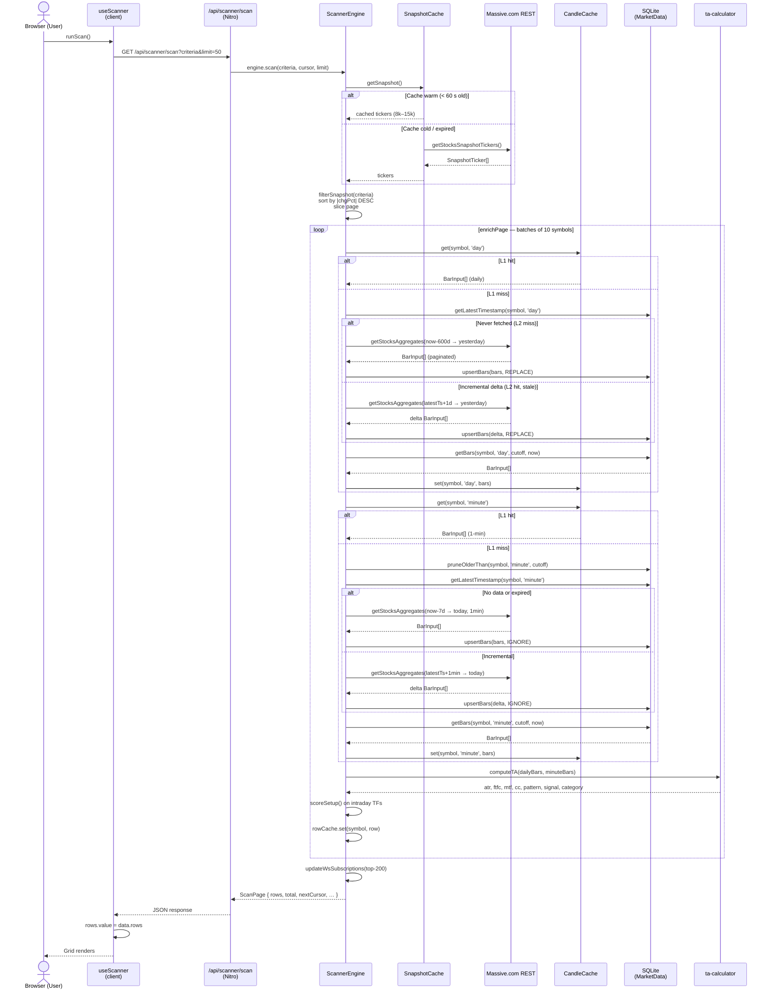
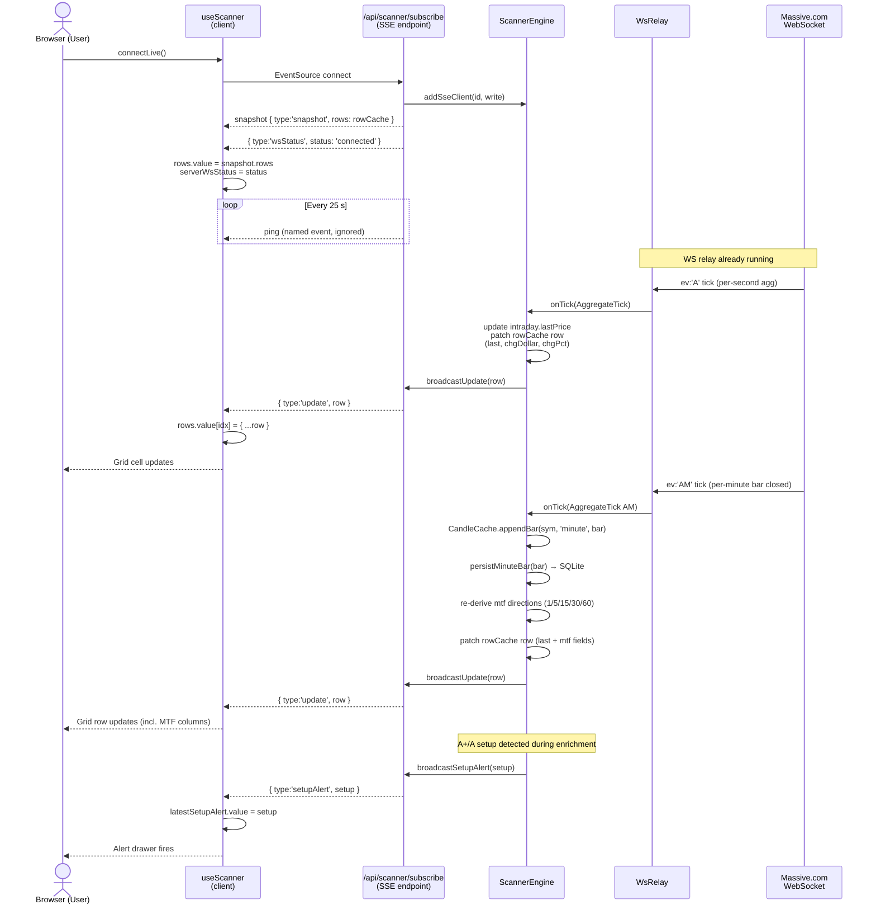
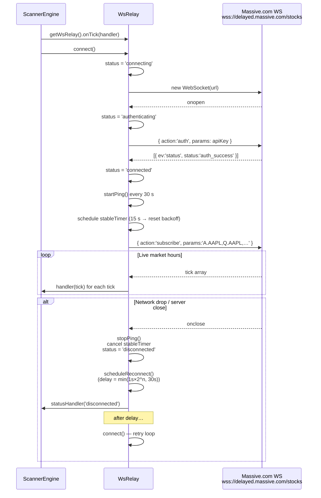

# Data Architecture — Pulse Trader

> A comprehensive reference for how data flows through the application: from external source ingestion, through multi-layer caching, to live WebSocket delivery and client-side state management.

---

## Table of Contents

1. [Overview & Philosophy](#1-overview--philosophy)
2. [External Data Source — Massive.com](#2-external-data-source--massivecom)
3. [Persistence Layer — SQLite](#3-persistence-layer--sqlite)
4. [Server-Side Caching Layers](#4-server-side-caching-layers)
   - 4.1 [SnapshotCache — Market-Wide Snapshot](#41-snapshotcache--market-wide-snapshot)
   - 4.2 [CandleCache — In-Memory OHLCV Store](#42-candlecache--in-memory-ohlcv-store)
5. [Data Ingestion Paths](#5-data-ingestion-paths)
   - 5.1 [Daily Bars (L1→L2→L3)](#51-daily-bars-l1l2l3)
   - 5.2 [1-Minute Bars (L1→L2→L3, Rolling Window)](#52-1-minute-bars-l1l2l3-rolling-window)
   - 5.3 [Derived Timeframes (In-Memory)](#53-derived-timeframes-in-memory)
6. [Scanner Engine — The Orchestrator](#6-scanner-engine--the-orchestrator)
   - 6.1 [Scan Pipeline (Step-by-Step)](#61-scan-pipeline-step-by-step)
   - 6.2 [Row Cache](#62-row-cache)
   - 6.3 [Intraday State Map](#63-intraday-state-map)
7. [Live Data — WebSocket Relay](#7-live-data--websocket-relay)
   - 7.1 [Connection Lifecycle & Reconnect](#71-connection-lifecycle--reconnect)
   - 7.2 [Subscription Tiers](#72-subscription-tiers)
   - 7.3 [Tick Processing](#73-tick-processing)
8. [Server → Client Push — SSE](#8-server--client-push--sse)
9. [API Endpoints Summary](#9-api-endpoints-summary)
10. [Client-Side State Management](#10-client-side-state-management)
    - 10.1 [useScanner (Module-Level Singleton)](#101-usescanner-module-level-singleton)
    - 10.2 [useScanCriteria](#102-usescancriteria)
    - 10.3 [localStorage Persistence](#103-localstorage-persistence)
11. [Settings & Credential Handling](#11-settings--credential-handling)
12. [TA Computation](#12-ta-computation)
13. [Complete Data Flow Diagrams](#13-complete-data-flow-diagrams)
    - 13.1 [ASCII Overview](#131-ascii-overview)
    - 13.2 [Mermaid Flowchart](#132-mermaid-flowchart)
14. [Sequence Diagrams](#14-sequence-diagrams)
    - 14.1 [Scan Request — Full Cold Path](#141-scan-request--full-cold-path)
    - 14.2 [SSE Connection & Live Tick Update](#142-sse-connection--live-tick-update)
    - 14.3 [WebSocket Relay Lifecycle](#143-websocket-relay-lifecycle)
15. [Known Gaps & Improvement Opportunities](#15-known-gaps--improvement-opportunities)

---

## 1. Overview & Philosophy

Pulse Trader follows a **layered, cache-first** architecture. The same bar data is accessed through three progressively slower layers:

```
L1  In-Memory (CandleCache)   — sub-millisecond, per-process singleton
L2  SQLite (MarketData table)  — millisecond reads, persistent across restarts
L3  Massive.com API            — network I/O, rate-limited, authoritative source
```

The scanner always tries L1 first, falls back to L2 (with incremental delta), and only hits L3 when the local store is empty or stale. Live price updates bypass this stack entirely — they arrive via WebSocket and are patched directly into the in-memory row cache, then fan-out to connected browsers via SSE.

---

## 2. External Data Source — Massive.com

All market data originates from **Massive.com** (`@massive.com/client-js`).

| Data type | Endpoint used | Cadence |
|---|---|---|
| Full-market snapshot | `getStocksSnapshotTickers()` | On-demand, cached 60 s |
| Aggregate bars (daily) | `getStocksAggregates()` with pagination | Per scan (incremental delta) |
| Aggregate bars (1-min) | `getStocksAggregates()` with pagination | Per scan (rolling 7-day window) |
| Ticker search | `listTickers()` | On-demand |
| WebSocket live feed | `wss://delayed.massive.com/stocks` | Continuous |

### Credentials

Stored encrypted in `Settings` (SQLite). Retrieved and decrypted at runtime via `getBrokerCredentials()` / `getDecryptedBrokerDetails()` — the raw API key is never held in plain text beyond the lifetime of a single request.

### Pagination

`fetchAggregates()` follows `next_url` cursors automatically, appending pages until the full date range is collected. Each page can return up to 50,000 bars.

---

## 3. Persistence Layer — SQLite

**File:** `data/pulse-trader.db`  
**Driver:** `better-sqlite3` (synchronous API)  
**WAL mode:** enabled — allows concurrent reads during writes.

### MarketData table (migration `20260326000000`)

```sql
CREATE TABLE MarketData (
  Id           TEXT PRIMARY KEY,
  Ticker       TEXT NOT NULL,
  Timespan     TEXT NOT NULL,   -- 'day' | 'minute'
  Timestamp    INTEGER NOT NULL, -- Unix ms
  Open         REAL NOT NULL,
  High         REAL NOT NULL,
  Low          REAL NOT NULL,
  Close        REAL NOT NULL,
  Volume       INTEGER NOT NULL,
  Transactions INTEGER,
  CreatedAt    TEXT NOT NULL,
  UNIQUE(Ticker, Timespan, Timestamp)
);

CREATE INDEX idx_market_data_lookup ON MarketData(Ticker, Timespan, Timestamp);
CREATE INDEX idx_market_data_ticker ON MarketData(Ticker);
```

Key behaviors:
- **Upsert strategy:** `INSERT OR REPLACE` for daily bars (always overwrite stale closes), `INSERT OR IGNORE` for minute bars (real-time append; avoids double-inserting).
- **Pruning:** Minute bars older than 7 calendar days are deleted before each fetch (`pruneOlderThan`).
- **Incremental deltas:** `getLatestTimestamp()` returns the newest stored bar's timestamp — the next fetch starts from that date + 1 day/minute.

### ConnectionManager

Singleton pattern using a module-level variable. The same `Database` instance is reused across all repository calls within a Nitro request. Shutdown is handled by the database plugin on server close.

---

## 4. Server-Side Caching Layers

### 4.1 SnapshotCache — Market-Wide Snapshot

**File:** `src/server/services/snapshot-cache.ts`  
**Scope:** `globalThis.__snapshotCache` — survives hot-reload in dev mode

```
TTL: 60 seconds (CACHE_TTL_MS = 60_000)
```

The snapshot is the **universe of all US stocks** — typically 8,000–15,000 tickers — with today's OHLCV, previous-day close, last trade price, VWAP, and today's change dollar/percent.

**Inflight deduplication:** if two scan requests arrive within the same second while the cache is cold, only one outbound API call is made. The second awaits the same `Promise`.

```
Request A ──▶ cache miss → fetch() starts → returns Promise
Request B ──▶ cache miss → inflight exists → awaits same Promise
```

### 4.2 CandleCache — In-Memory OHLCV Store

**File:** `src/server/services/candle-cache.ts`  
**Scope:** `globalThis.__candleCache`

```
Max entries: 2,000 (ticker:timespan keys)
TTL per timespan:
  minute  →  1 minute
  hour    →  60 minutes
  day     →  24 hours
  week    →  24 hours
  month   →  24 hours
```

**Eviction policy:** When the store reaches 2,000 entries, expired entries are removed first. If still at capacity, the 200 entries with the earliest `expiresAt` are dropped (approximate LRU).

**Real-time append:** `appendBar(ticker, timespan, bar)` is called for every `AM` (per-minute aggregate) WS event. If the last bar has the same timestamp it is replaced (in-progress bar update). Otherwise it is appended. This keeps the CandleCache current without a full re-fetch.

---

## 5. Data Ingestion Paths

### 5.1 Daily Bars (L1→L2→L3)

```
getDailyBars(symbol)
  │
  ├─ L1: CandleCache.get(symbol, 'day')
  │       Hit → return immediately (sub-ms)
  │
  └─ Miss → getOrSyncDailyBars(symbol)
              │
              ├─ L2: MarketDataRepository.getLatestTimestamp(symbol, 'day')
              │
              ├─ null (first fetch)
              │   → L3: fetchAggregates(symbol, 1, 'day', now-600d, yesterday)
              │   → upsertBars(bars, REPLACE) into SQLite
              │
              └─ has data (incremental)
                  → from = latestTimestamp + 1 day
                  → if from ≤ yesterday: L3 fetch delta only
                  → upsertBars(delta, REPLACE)
              
              → Read all bars from SQLite (cutoff: now-600 calendar days)
              → CandleCache.set(symbol, 'day', bars)
              → return bars
```

**Lookback window:** 600 calendar days (~400 trading days) — sufficient for long-term Strat analysis (weekly/monthly bars, ATR14, etc.).

**Today's bar:** Intentionally excluded from storage. Today's live price comes from the snapshot (`lastTrade.p` / `day.c`) and WS ticks. This prevents storing a partial candle that would corrupt TA calculations.

### 5.2 1-Minute Bars (L1→L2→L3, Rolling Window)

```
getIntradayBars(symbol)
  │
  ├─ L1: CandleCache.get(symbol, 'minute')
  │       Hit → return immediately
  │
  └─ Miss → getOrSyncMinuteBars(symbol)
              │
              ├─ Prune SQLite: delete bars older than 7 calendar days
              │
              ├─ L2: getLatestTimestamp(symbol, 'minute')
              │
              ├─ null or expired (full window fetch)
              │   → L3: fetchAggregates(symbol, 1, 'minute', now-7d, today)
              │   → upsertBars(bars, IGNORE)
              │
              └─ has data (incremental)
                  → from = latestTimestamp + 60s (next minute)
                  → if from ≤ today: L3 fetch delta
                  → upsertBars(delta, IGNORE)
              
              → Read window from SQLite (cutoff: now-7d)
              → CandleCache.set(symbol, 'minute', bars)
              → return bars
```

**Real-time continuation:** After the initial fetch, new 1-min bars are written by the WS `AM` event handler (`persistMinuteBar` + `CandleCache.appendBar`) — no polling required.

### 5.3 Derived Timeframes (In-Memory)

All higher timeframes are **derived on-the-fly** from raw 1-min or daily bars using pure aggregation functions in `ta-calculator.ts`. Nothing is stored in SQLite for derived timeframes.

| Timeframe | Source | Function |
|---|---|---|
| 5-min | 1-min bars | `aggregateTo5min()` |
| 15-min | 1-min bars | `aggregateTo15min()` |
| 30-min | 1-min bars | `aggregateTo30min()` |
| 60-min | 1-min bars | `aggregateTo60min()` |
| Weekly | Daily bars | `aggregateToWeekly()` |
| Monthly | Daily bars | `aggregateToMonthly()` |
| Quarterly | Daily bars | (derived from monthly) |
| Yearly | Daily bars | (derived from monthly) |

---

## 6. Scanner Engine — The Orchestrator

**File:** `src/server/services/scanner-engine.ts`  
**Scope:** `globalThis.__scannerEngine` singleton

The engine is the central coordinator. It owns the row cache, manages WS subscriptions, drives SSE fan-out, and processes real-time ticks.

### 6.1 Scan Pipeline (Step-by-Step)

```
POST /api/scanner/scan?<criteria>
│
1. SnapshotCache.getSnapshot()
   → Full market snapshot (8k–15k tickers), deduplicated by ticker
│
2. filterSnapshot(snapshot, criteria)
   → Price range, change%, volume filters applied
   → Produces candidate list (typically 100–2,000 tickers)
│
3. candidates.sort() by |todaysChangePerc| DESC
   → Biggest movers first
│
4. Pagination: find cursor offset in sorted list
│
5. Pre-populate intraday state for top-200 symbols
   → Stores prevDayClose for live chg$/chg% computation
│
6. enrichPage(page, MAX_CONCURRENCY=10)
   For each ticker (batched 10 at a time):
   │
   ├─ getDailyBars(ticker)     → L1 → L2 → L3
   ├─ getIntradayBars(ticker)  → L1 → L2 → L3 (optional, non-fatal)
   │
   ├─ computeTA(dailyBars, minuteBars)
   │   → ATR%, ATR$, avgVol30, FTFC, MTF, CC codes, pattern, signal, category, inForce
   │
   ├─ computeRVOL(todayVol, avgVol30)
   │
   ├─ Live price from WS intraday state (or snapshot fallback)
   │
   └─ scoreSetup() on intraday TFs (30M → 60M → 15M → 5M, first match wins)
│
7. Update rowCache with enriched rows
│
8. updateWsSubscriptions(top-200)
   → Tier 1 (0–49): A + Q subscriptions
   → Tier 2 (50–199): A only
│
9. Return ScanPage { rows, total, nextCursor, universeCount, lastScan }
```

### 6.2 Row Cache

`Map<string, ScannerRow>` — holds the last known state of every scanned symbol.

- Populated during `enrichPage()`
- Patched on every WS `A`/`AM`/`T` tick
- Served as initial `snapshot` to new SSE clients on connect
- Never expires automatically — stale if the engine hasn't scanned in a long time

### 6.3 Intraday State Map

`Map<string, IntradayState>` — per-symbol ephemeral state:

```typescript
interface IntradayState {
  '1':  MtfSignal    // last 1-min bar direction
  '5':  MtfSignal    // derived 5-min direction
  '15': MtfSignal
  '30': MtfSignal
  '60': MtfSignal
  lastPrice?:    number   // most recent WS tick price
  accVolume?:    number   // accumulated volume today (av field)
  prevDayClose?: number   // populated at scan time from snapshot
}
```

Used by the tick handler to compute live `chgDollar` and `chgPct` without a snapshot lookup on every tick.

---

## 7. Live Data — WebSocket Relay

**File:** `src/server/services/ws-relay.ts`  
**Scope:** `globalThis.__wsRelay` singleton

The relay maintains **one persistent WebSocket connection** to `wss://delayed.massive.com/stocks` and distributes ticks to registered handlers.

### 7.1 Connection Lifecycle & Reconnect

```
States: disconnected → connecting → authenticating → connected → error
                                                         ↑              │
                                                         └──────────────┘
                                               (exponential backoff reconnect)

Reconnect schedule:
  Attempt 1:  1 s
  Attempt 2:  2 s
  Attempt 3:  4 s
  …
  Max:        30 s
  Max attempts: 10

Stability reset: backoff counter resets after 15 s of uninterrupted connectivity.
Keep-alive ping: every 30 s (named 'ping' event, ignored by server).
```

**Auth flow:**
1. `onopen` → send `{ action: 'auth', params: apiKey }`
2. Server replies `{ ev: 'status', status: 'auth_success' }`
3. Re-subscribe to all pending subscriptions

### 7.2 Subscription Tiers

```
Tier 1 (top 50 movers):   A.<sym> + Q.<sym>   → per-second aggregate + quote stream
Tier 2 (rank 51–200):     A.<sym>              → per-second aggregate only

Total max subscriptions: (50 × 2) + 150 = 250 channels
```

Subscriptions are sent in batches of 100 (`sendSubscribe`). `updateSubscriptions()` diffs the desired set against the current set and sends only `subscribe`/`unsubscribe` deltas — minimising protocol overhead on each scan refresh.

### 7.3 Tick Processing

```
WS onmessage → parse JSON array
  │
  ├─ ev === 'status' → update relay state (auth_success / auth_failed)
  │
  ├─ ev === 'A'  (per-second aggregate)
  │   → update state.lastPrice, state.accVolume
  │   → patch rowCache row: last, chgDollar, chgPct
  │   → broadcastUpdate(row) → all SSE clients
  │
  ├─ ev === 'AM' (per-minute aggregate — completed bar)
  │   → update state.lastPrice, state.accVolume
  │   → CandleCache.appendBar(sym, 'minute', bar)
  │   → persistMinuteBar(bar) → SQLite (INSERT OR IGNORE)
  │   → re-derive all intraday directions (1/5/15/30/60) from updated CandleCache
  │   → patch rowCache row: last, chgDollar, chgPct, mtf[1/5/15/30/60]
  │   → broadcastUpdate(row) → all SSE clients
  │
  └─ ev === 'T'  (individual trade)
      → update state.lastPrice only (no bar storage)
      → patch rowCache row: last, chgDollar, chgPct
      → broadcastUpdate(row) → all SSE clients
```

`ev === 'Q'` (quote ticks) are received but not currently processed — bid/ask data is unused at this time.

---

## 8. Server → Client Push — SSE

**Endpoint:** `GET /api/scanner/subscribe`  
**File:** `src/server/api/scanner/subscribe.get.ts`

Uses Nitro's `createEventStream` (H3). Each browser tab opens one SSE connection.

### Message types

| type | Payload | When sent |
|---|---|---|
| `snapshot` | `{ rows: ScannerRow[] }` | On connect (from rowCache), and after a scan completes with rows |
| `update` | `{ row: ScannerRow }` | On every WS tick that mutates a cached row |
| `wsStatus` | `{ status: WsStatus }` | On WS relay state changes |
| `setupAlert` | `{ setup: StratSetup }` | When an A+/A quality setup is first detected |
| `ping` | `'ping'` | Every 25 s (named event, ignored by `onmessage`) |

### SSE client lifecycle

```
EventSource connects
→ engine.addSseClient(id, write)
→ push snapshot (current rowCache)
→ push current wsStatus

... (live updates stream in via broadcastUpdate/broadcastStatus/broadcastSetupAlert)

EventSource closes
→ stream.onClosed()
→ clearInterval(ping)
→ engine.removeSseClient(id)
```

### Client reconnection

`EventSource` reconnects automatically on error (browser built-in). The `onerror` handler in `useScanner` sets `wsStatus = 'error'`. On the next `onopen`, `wsStatus = 'connected'` and the server sends a fresh snapshot + wsStatus frame.

---

## 9. API Endpoints Summary

| Method | Path | Purpose |
|---|---|---|
| `GET` | `/api/scanner/scan` | Run scan, returns paginated `ScannerRow[]` |
| `GET` | `/api/scanner/subscribe` | SSE stream for live row updates |
| `GET` | `/api/scanner/chart-bars` | Multi-TF OHLCV bars for chart overlay |
| `GET` | `/api/scanner/logs` | Server-side `appLog` entries |
| `GET` | `/api/scanner/status` | Engine diagnostics (wsStatus, cachedRows, sseClients) |
| `GET` | `/api/market-data/tickers` | Ticker search (Massive.com passthrough) |
| `GET` | `/api/market-data/status` | SQLite bar counts / date ranges |
| `GET` | `/api/market-data/aggregates` | Read bars from SQLite cache |
| `POST` | `/api/market-data/sync` | Manual bulk sync (multi-ticker) |
| `POST` | `/api/market-data/validate` | Test Massive.com API connection |
| `POST` | `/api/market-data/delete` | Delete bars for a ticker/timespan |

---

## 10. Client-Side State Management

### 10.1 useScanner (Module-Level Singleton)

**File:** `src/app/composables/useScanner.ts`

All reactive state lives at **module scope** (not inside `setup()`), so it is shared across all component instances on the page — a true singleton.

**Key reactive refs:**

| ref | Type | Description |
|---|---|---|
| `rows` | `ScannerRow[]` | Current page of scan rows (mutable by SSE) |
| `total` | `number` | Total matched tickers (before pagination) |
| `universeCount` | `number` | Total snapshot tickers examined |
| `isScanning` | `boolean` | In-flight scan request flag |
| `nextCursor` | `string \| null` | Symbol to paginate from |
| `wsStatus` | `WsStatus` | SSE connection state (client-side EventSource) |
| `serverWsStatus` | `WsStatus` | Server-side WS relay state (pushed via SSE) |
| `latestSetupAlert` | `StratSetup \| null` | Most recent A+/A alert |

**Key derived (computed):**

| computed | Description |
|---|---|
| `filteredRows` | `rows` after quick-filter + client-side sort |

**Scan flow:**
```
runScan()
  → GET /api/scanner/scan?<criteria>&limit=50
  → rows.value = data.rows (or append if loadMore)
  → total.value, universeCount, lastScan, nextCursor updated
  → onScanRowsLoaded() callback clears stale column filters

loadMore()
  → GET /api/scanner/scan?<criteria>&cursor=<last>&limit=50
  → rows.value = [...rows.value, ...data.rows]
```

**Debounced scan trigger:** `scheduleScan()` debounces 300 ms — criteria changes don't fire immediately.

### 10.2 useScanCriteria

**File:** `src/app/composables/useScanCriteria.ts`

Module-level singleton. Criteria changes persist to `localStorage` automatically (`pulse-scanner-criteria`).

Fields: `minPrice`, `maxPrice`, `minChangePercent`, `maxChangePercent`, `minVolume`, `minRvol`.

### 10.3 localStorage Persistence

| Key | Contents | Managed by |
|---|---|---|
| `pulse-scanner-criteria` | `ScanCriteria` object | `useScanCriteria` |
| `pulse-scanner-state` | timeframe, mode, quickFilter, sortKey, sortDir | `useScanner` |
| `pulse-grid-columns-*` | Column visibility/order per layout | `useGridColumns` |
| `pulse-grid-layouts-*` | Named layout presets | `useGridLayouts` |
| `pulse-grid-filter-presets-*` | Saved column filter presets | `useGridFilterPresets` |

---

## 11. Settings & Credential Handling

**Repository:** `SettingsRepository` → `Settings` table (SQLite)  
**Encryption:** `src/server/utils/encryption.ts`

API keys (`data-broker-details`) are stored encrypted. The `decryptJsonFields(key, fields)` utility decrypts at request time — the plain-text key exists only in memory for the duration of the API call. No secrets are logged or returned to the client.

---

## 12. TA Computation

**File:** `src/server/services/ta-calculator.ts` — pure stateless functions

Computed **once per enrichment**, not cached beyond the row cache. Re-derived for the MTF fields on every `AM` WS tick using the updated CandleCache.

| Metric | Inputs | Notes |
|---|---|---|
| `atrDollar` / `atrPct` | 14 daily bars | 14-period ATR |
| `avgVol30` | 30 daily bars | 30-session average volume |
| `inForce` | daily bars | Strat "in force" concept |
| `ftfc` | daily bars | Full-Time Frame Continuity |
| `mtf` | daily + minute bars | Multi-timeframe signal: 1/5/15/30/60/D/W/M/Q/Y |
| `cc`, `cc1`, `cc2` | last 3 bars on primary TF | Candle codes (1, 2u, 2d, 3) |
| `pattern` | cc2-cc1-cc | Pattern string e.g. `"1-2u"` |
| `signal` | pattern | Human-readable signal e.g. `"Inside Up"` |
| `category` | pattern | Continuation / Reversal / Inside / Continuation+ |
| `rvol` | accVolume, avgVol30 | Relative volume ratio |

---

## 13. Complete Data Flow Diagrams

### 13.1 ASCII Overview

```
┌─────────────────────────────────────────────────────────────────────────┐
│  EXTERNAL                                                               │
│                                                                         │
│  Massive.com REST API          Massive.com WebSocket                    │
│  (HTTPS aggregates/snapshot)   (wss://delayed.massive.com/stocks)       │
└─────────────┬─────────────────────────────┬───────────────────────────-┘
              │ fetchAggregates()            │ A / AM / T / Q ticks
              │ getStocksSnapshotTickers()   │
              ▼                             ▼
┌─────────────────────────────┐  ┌────────────────────────────────────────┐
│  SERVER (Nitro/Node.js)     │  │  WsRelay (singleton)                   │
│                             │  │  • Single WS conn, auth, keep-alive    │
│  SnapshotCache (60s TTL)    │  │  • Exponential backoff reconnect       │
│  • All US stocks snapshot   │  │  • Per-tick: onTick handlers           │
│  • Inflight deduplication   │  └──────────────────┬─────────────────────┘
│                             │                     │ onTick('scanner-engine', ...)
│  CandleCache (2k entries)   │                     ▼
│  • LRU by expiresAt         │  ┌────────────────────────────────────────┐
│  • appendBar() for AM ticks │  │  ScannerEngine (singleton)             │
│                             │  │                                         │
│  SQLite MarketData          │  │  rowCache: Map<sym, ScannerRow>         │
│  • Permanent daily bars     │  │  intraday: Map<sym, IntradayState>      │
│  • Rolling 7-day 1-min bars │  │  sseClients: Map<id, SseWriter>        │
│  • WAL mode                 │  │  alertsSent: Set<string>               │
│  • idx on (Ticker,TF,Ts)    │  │                                         │
└─────────────────────────────┘  │  scan() pipeline:                      │
              ▲                  │  1. snapshot → filter → sort           │
              │ upsertBars()     │  2. enrichPage() [concurrency=10]      │
              │ getBars()        │  3. computeTA()                         │
              │ persistMinuteBar │  4. scoreSetup()                        │
              │                  │  5. updateWsSubscriptions()            │
              └──────────────────┤                                         │
                                 │  onTick():                              │
                                 │  1. update intraday state              │
                                 │  2. AM: CandleCache.appendBar()        │
                                 │  3. AM: persistMinuteBar()             │
                                 │  4. patch rowCache row                  │
                                 │  5. broadcastUpdate() → SSE            │
                                 └──────────────────┬─────────────────────┘
                                                    │ SSE frames
                                                    │ (snapshot/update/wsStatus/alert)
                                                    ▼
┌───────────────────────────────────────────────────────────────────────-─┐
│  BROWSER (Vue 3 / Nuxt)                                                 │
│                                                                         │
│  EventSource /api/scanner/subscribe                                     │
│  ↓ onmessage                                                            │
│  useScanner (module singleton)                                          │
│  • rows ref ← snapshot / per-row update                                │
│  • serverWsStatus ref                                                   │
│  • latestSetupAlert ref                                                 │
│                                                                         │
│  filteredRows (computed)                                                │
│  ← rows + quickFilter + sortKey/Dir                                     │
│                                                                         │
│  ScannerGridTable.vue ← filteredRows                                   │
│  ScannerStatusBar.vue ← wsStatus, serverWsStatus, total, lastScan     │
│  ScannerAlertsDrawer.vue ← latestSetupAlert                            │
│  ScannerSymbolChart.vue ← GET /api/scanner/chart-bars                  │
└─────────────────────────────────────────────────────────────────────────┘
```

---
### 13.2 Mermaid Flowchart

```mermaid
flowchart TD
    %% ── External ─────────────────────────────────────────────────────────
    subgraph EXT["☁ External — Massive.com"]
        REST["REST API\ngetStocksSnapshotTickers\ngetStocksAggregates\nlistTickers"]
        WSS["WebSocket\nwss://delayed.massive.com/stocks\nA · AM · T · Q ticks"]
    end

    %% ── Server singletons ────────────────────────────────────────────────
    subgraph SRV["⚙ Server — Nitro / Node.js"]

        subgraph CREDS["🔐 Credentials"]
            SETTINGS[("SQLite\nSettings table\n(encrypted API key)")]
        end

        subgraph SNAP["SnapshotCache"]
            SC["60 s TTL\nInflight dedup\n8k–15k tickers"]
        end

        subgraph CACH["CandleCache"]
            CC["In-memory\n2 000 entries LRU\nTTL per timespan\nappendBar() on AM tick"]
        end

        subgraph DB["SQLite — MarketData"]
            DT["MarketData table\nTicker · Timespan · Timestamp\nUNIQUE(Ticker,Timespan,Ts)\nidx on (Ticker, Timespan, Timestamp)\nWAL mode"]
        end

        subgraph MDS["market-data.service"]
            GDB["getOrSyncDailyBars()\nL1→L2→L3\n600-day history\nIncremental delta"]
            GMB["getOrSyncMinuteBars()\nL1→L2→L3\nRolling 7-day window\nPrune + incremental"]
            PMB["persistMinuteBar()\nINSERT OR IGNORE"]
        end

        subgraph WR["WsRelay singleton"]
            WSR["Single WS connection\nAuth handshake\nExp. backoff reconnect\n30 s keep-alive ping"]
            TIER["Tier 1 — top 50: A+Q\nTier 2 — 51-200: A only\nbatch subscribe/unsubscribe diff"]
        end

        subgraph SE["ScannerEngine singleton"]
            SCAN["scan()\n1. snapshot → filterSnapshot()\n2. sort by |chgPct| DESC\n3. enrichPage() ×10 concurrent"]
            ENR["enrichTicker()\ndailyBars L1→L2→L3\nminuteBars L1→L2→L3\ncomputeTA() · scoreSetup()"]
            TICK["onTick()\nupdate intraday state\npatch rowCache · broadcast"]
            RC[("rowCache\nMap‹sym, ScannerRow›")]
            IS[("intraday\nMap‹sym, IntradayState›\nlastPrice · accVol\nprevDayClose")]
            SSE_REG[("sseClients\nMap‹id, SseWriter›")]
            ALERTS[("alertsSent\nSet‹string›")]
        end

        subgraph TA["ta-calculator (pure)"]
            TA_FN["computeTA()\nATR14 · avgVol30\nCC codes · pattern\nsignal · category\ninForce · FTFC · MTF"]
            AGG["aggregateTo5/15/30/60min()\naggregateToWeekly/Monthly/Q/Y()"]
        end

        subgraph SSE_EP["/api/scanner/subscribe"]
            SSE_H["createEventStream()\n25 s ping\naddSseClient on open\nremoveSseClient on close\npush snapshot on connect"]
        end
    end

    %% ── Browser ──────────────────────────────────────────────────────────
    subgraph BRW["🖥 Browser — Vue 3 / Nuxt"]
        LS[("localStorage\ncriteria · scanner-state\ngrid columns · layouts")]

        subgraph CS["Client State (module singletons)"]
            USC["useScanCriteria\nminPrice · maxPrice\nminChg% · minVol · minRvol"]
            USS["useScanner\nrows · total · wsStatus\nserverWsStatus · latestSetupAlert\nfilteredRows (computed)"]
        end

        ESRC["EventSource\n/api/scanner/subscribe"]

        subgraph UI["Components"]
            GRID["ScannerGridTable\nlocalFilteredRows (col filters)"]
            STAT["ScannerStatusBar\nwsStatus · total · lastScan"]
            ALRT["ScannerAlertsDrawer\nlatestSetupAlert"]
            CHART["ScannerSymbolChart\nGET /api/scanner/chart-bars"]
        end
    end

    %% ── Flow: credentials ────────────────────────────────────────────────
    SETTINGS -->|decrypt at runtime| GDB
    SETTINGS -->|decrypt at runtime| WSR
    SETTINGS -->|decrypt at runtime| SC

    %% ── Flow: snapshot ───────────────────────────────────────────────────
    REST -->|getStocksSnapshotTickers| SC
    SC -->|cached snapshot| SCAN

    %% ── Flow: bar ingestion L3 ───────────────────────────────────────────
    REST -->|getStocksAggregates paginated| GDB
    REST -->|getStocksAggregates paginated| GMB

    %% ── Flow: bar ingestion L2 ───────────────────────────────────────────
    GDB <-->|getBars / upsertBars REPLACE| DT
    GMB <-->|getBars / upsertBars IGNORE / pruneOlderThan| DT
    PMB -->|upsertBars IGNORE| DT

    %% ── Flow: bar ingestion L1 ───────────────────────────────────────────
    GDB <-->|get / set| CC
    GMB <-->|get / set| CC

    %% ── Flow: scan enrichment ────────────────────────────────────────────
    SCAN --> ENR
    ENR -->|getDailyBars L1→L2→L3| GDB
    ENR -->|getIntradayBars L1→L2→L3| GMB
    ENR --> TA_FN
    TA_FN --> AGG
    ENR -->|rows| RC
    SCAN -->|updateWsSubscriptions| TIER

    %% ── Flow: WebSocket ──────────────────────────────────────────────────
    WSS <-->|connect / auth / subscribe| WSR
    TIER -->|subscribe/unsubscribe msgs| WSR
    WSR -->|onTick A/AM/T| TICK
    TICK -->|update lastPrice/accVol| IS
    TICK -->|AM: appendBar| CC
    TICK -->|AM: persistMinuteBar| PMB
    TICK -->|patch row| RC
    TICK -->|broadcastUpdate| SSE_REG
    TICK -->|broadcastStatus| SSE_REG
    TICK -->|check & fire alert| ALERTS
    ALERTS -->|A+/A setupAlert| SSE_REG

    %% ── Flow: SSE ────────────────────────────────────────────────────────
    SSE_REG --> SSE_H
    RC -->|initial snapshot on connect| SSE_H
    SSE_H <-->|EventSource| ESRC

    %% ── Flow: client state ───────────────────────────────────────────────
    ESRC -->|snapshot · update · wsStatus · setupAlert| USS
    USC <-->|persist/load| LS
    USS <-->|persist/load| LS
    USS -->|GET /api/scanner/scan| SCAN
    USS --> filteredRows
    filteredRows["filteredRows\n(computed)"] --> GRID
    USS --> STAT
    USS --> ALRT

    %% ── Flow: chart ──────────────────────────────────────────────────────
    CHART -->|GET /api/scanner/chart-bars| GDB
    CHART -->|GET /api/scanner/chart-bars| GMB
    CHART -->|aggregate| AGG

    %% ── Styles ───────────────────────────────────────────────────────────
    classDef external  fill:#1a3a4a,stroke:#2a7a9a,color:#a0d8ef
    classDef cache     fill:#1a3a1a,stroke:#2a7a2a,color:#a0efa0
    classDef db        fill:#3a2a1a,stroke:#9a6a2a,color:#efd0a0
    classDef service   fill:#2a2a3a,stroke:#5a5a9a,color:#c0c0ef
    classDef browser   fill:#2a1a3a,stroke:#7a2a9a,color:#d0a0ef
    classDef component fill:#1a1a2a,stroke:#4a4a7a,color:#a0a0df

    class REST,WSS external
    class SC,CC cache
    class DT,SETTINGS db
    class GDB,GMB,PMB,WSR,TIER,SCAN,ENR,TICK,TA_FN,AGG service
    class RC,IS,SSE_REG,ALERTS db
    class USS,USC,ESRC,LS browser
    class GRID,STAT,ALRT,CHART,filteredRows component
```



---
## 14. Sequence Diagrams

### 14.1 Scan Request — Full Cold Path



### 14.2 SSE Connection & Live Tick Update



### 14.3 WebSocket Relay Lifecycle



---

## 15. Known Gaps & Improvement Opportunities

### Performance

| Area | Issue | Possible Fix |
|---|---|---|
| **Scan concurrency** | `MAX_CONCURRENCY = 10` per page — 50-row page takes ≥5 serial batches | Increase to 20–25 once API rate-limit headroom is confirmed |
| **CandleCache eviction** | Sorted full-map scan on eviction (O(n log n)) | Use a min-heap or doubly-linked LRU list for O(1) eviction |
| **SQLite on hot path** | `getOrSyncDailyBars` does a `getBars` read on every scan miss, even if CandleCache is warm from a recent scan | Cache hit rate is already high; consider TTL-based warming on startup |
| **Derived TF recomputation** | On every `AM` tick, all 5 intraday directions are re-derived from the full CandleCache minute-bar array | Store rolling aggregated bars directly for 5/15/30/60 in CandleCache |
| **SnapshotCache single TTL** | 60 s TTL regardless of market hours — pre/post market snapshots change slowly | Use a longer TTL outside regular trading hours (e.g. 5 min) |
| **No index on Timestamp only** | Range queries must always include Ticker + Timespan | Existing composite index covers all query patterns — low priority |

### Correctness & Reliability

| Area | Issue |
|---|---|
| **Quote ticks (`Q`) unused** | Bid/ask data arrives from Tier 1 subscriptions but is discarded — opportunity for spread monitoring |
| **rowCache never expires** | A symbol scanned once stays in the cache indefinitely; after criteria change, stale rows may persist until the next scan |
| **alertsSent never cleared** | `Set<string>` grows unbounded across the server lifetime — could leak memory for long-running processes |
| **WS on server thread** | The Node.js WS client runs on the server process; heavy parsing of large tick arrays could block the event loop momentarily |
| **No SSE back-pressure** | `stream.push()` errors are silently caught — a slow client can fall behind without detection |
| **Pagination cursor by symbol** | Cursor is a ticker string found by linear scan (`findIndex`) — O(n) on each page-2+ request |

### Observability

| Area | Issue |
|---|---|
| **No metrics** | Bar fetch latency, cache hit rates, scan duration, WS reconnect count — none are exposed |
| **appLog is in-memory ring buffer** | Log entries are lost on restart; no structured log export |
| **No CandleCache hit/miss counters** | Cannot tell what fraction of scan enrichments hit L1 vs L2 vs L3 |

### Data Quality

| Area | Issue |
|---|---|
| **No adjusted-price flag surfaced** | API is called with `adjusted=true` but there is no indication in the UI or stored data whether bars are split-adjusted |
| **Minute bar rolling window = 7 calendar days** | On a Monday, Saturday + Sunday are included in the window — actual trading data spans only 5 sessions but the window accommodates weekends |
| **No gap detection** | If the API returns partial data (rate limit mid-pagination), the partial result is still upserted — the gap is never re-fetched |
