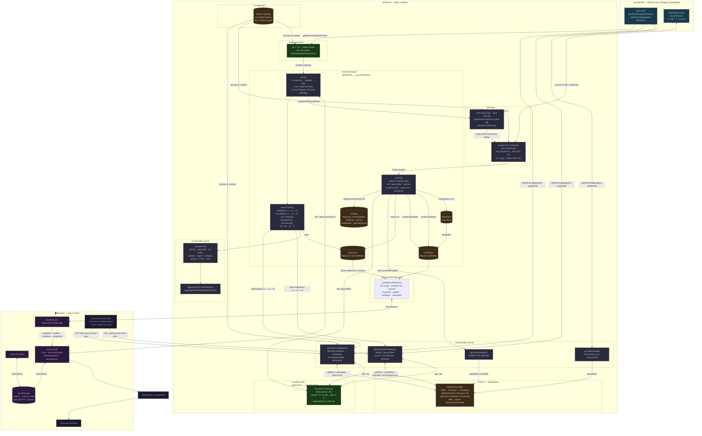
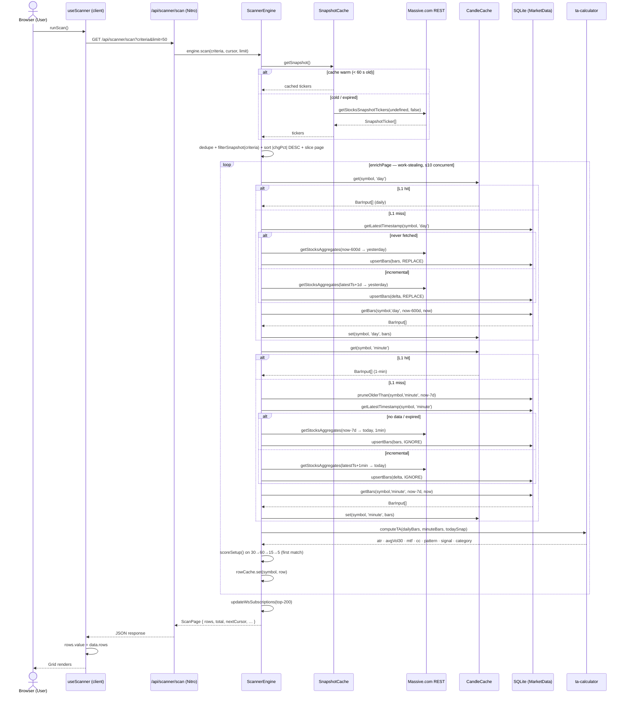
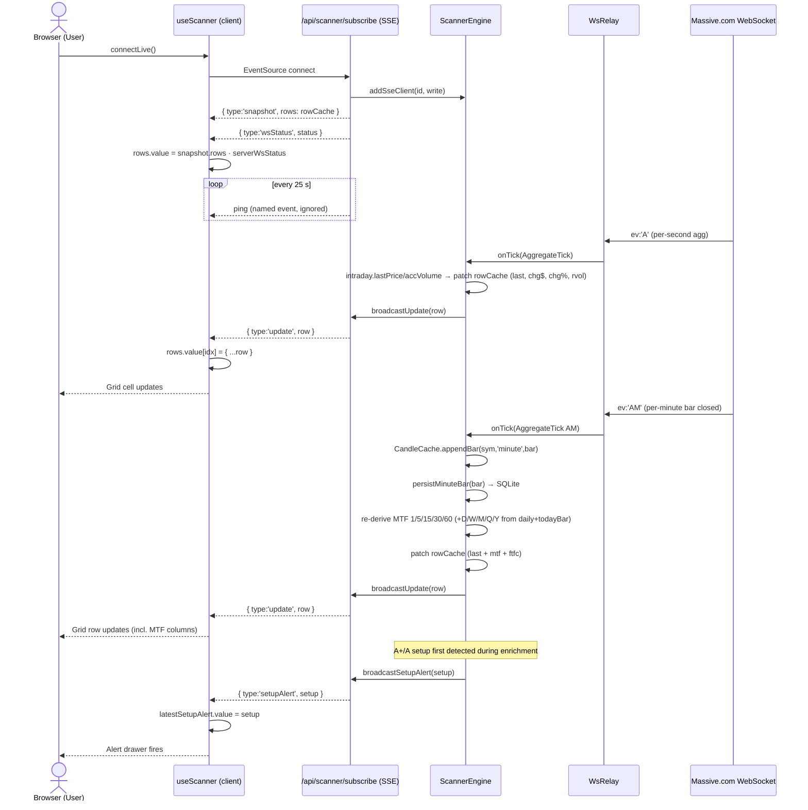
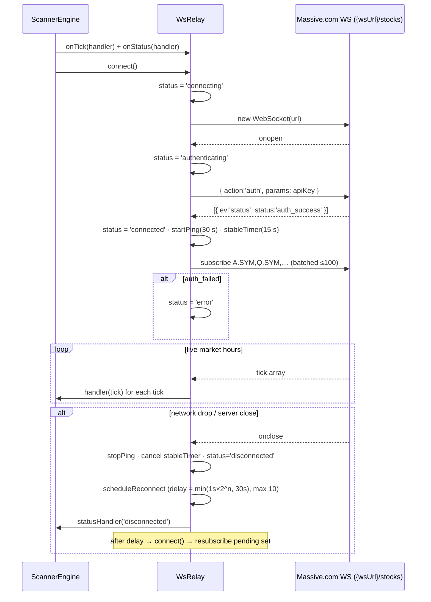

# Data Architecture — Pulse Trader

> **Authoritative reference for the data layer.** Every claim below was verified against the source code
> and the live SQLite database on **2026-08-03**. This document is the single source of truth to reference
> when refactoring the historical + live data mechanisms. It supersedes all previous architecture docs.
>
> Covered: external provider contract, SQLite schema + real DB state, the L1/L2/L3 cache stack, historical
> ingestion paths, the live WebSocket pipeline, SSE fan-out, client-side state, complete flow diagrams, and
> a verified list of gaps with refactor-targeted remediation notes.

---

## Table of Contents

1. [Overview & Philosophy](#1-overview--philosophy)
2. [External Data Source — Massive.com (Polygon-compatible)](#2-external-data-source--massivecom-polygon-compatible)
3. [Persistence Layer — SQLite](#3-persistence-layer--sqlite)
   - 3.1 [Schema](#31-schema)
   - 3.2 [Verified DB state (2026-08-03)](#32-verified-db-state-2026-08-03)
   - 3.3 [ConnectionManager & Repository](#33-connectionmanager--repository)
4. [Server-Side Caching Layers](#4-server-side-caching-layers)
   - 4.1 [SnapshotCache](#41-snapshotcache)
   - 4.2 [CandleCache](#42-candlecache)
5. [Data Ingestion Paths](#5-data-ingestion-paths)
   - 5.1 [Daily Bars (L1→L2→L3)](#51-daily-bars-l1l2l3)
   - 5.2 [1-Minute Bars (L1→L2→L3, Rolling Window)](#52-1-minute-bars-l1l2l3-rolling-window)
   - 5.3 [Derived Timeframes (In-Memory)](#53-derived-timeframes-in-memory)
   - 5.4 [Manual Bulk Sync](#54-manual-bulk-sync)
6. [Scanner Engine — The Orchestrator](#6-scanner-engine--the-orchestrator)
   - 6.1 [Scan Pipeline](#61-scan-pipeline)
   - 6.2 [Row Cache](#62-row-cache)
   - 6.3 [Intraday State Map](#63-intraday-state-map)
7. [Live Data — WebSocket Relay](#7-live-data--websocket-relay)
   - 7.1 [Connection Lifecycle & Reconnect](#71-connection-lifecycle--reconnect)
   - 7.2 [Subscription Tiers](#72-subscription-tiers)
   - 7.3 [Tick Processing](#73-tick-processing)
8. [Server → Client Push — SSE](#8-server--client-push--sse)
9. [API Endpoints Summary](#9-api-endpoints-summary)
10. [Client-Side State Management](#10-client-side-state-management)
11. [Settings & Credential Handling](#11-settings--credential-handling)
12. [TA Computation](#12-ta-computation)
13. [Complete Data Flow Diagrams](#13-complete-data-flow-diagrams)
    - 13.1 [ASCII Overview](#131-ascii-overview)
    - 13.2 [Mermaid Flowchart](#132-mermaid-flowchart)
14. [Sequence Diagrams](#14-sequence-diagrams)
    - 14.1 [Scan Request — Full Cold Path](#141-scan-request--full-cold-path)
    - 14.2 [SSE Connection & Live Tick Update](#142-sse-connection--live-tick-update)
    - 14.3 [WebSocket Relay Lifecycle](#143-websocket-relay-lifecycle)
15. [Known Gaps, Risks & Refactor Targets](#15-known-gaps-risks--refactor-targets)

---

## 1. Overview & Philosophy

Pulse Trader is a **layered, cache-first** trading journal + "The Strat" scanner. All market data originates
from **Massive.com** and is read through three progressively slower layers:

```
L1  In-Memory (CandleCache)      — sub-millisecond, per-process singleton (globalThis)
L2  SQLite (MarketData table)    — millisecond reads, persistent across restarts
L3  Massive.com REST API         — network I/O, rate-limited, authoritative source
```

The scanner always tries L1 first, falls back to L2 (with an incremental delta), and only hits L3 when the
local store is empty or stale. **Live prices bypass this stack entirely** — they arrive over a single
WebSocket connection and are patched directly into the in-memory row cache, then fan out to connected
browsers via SSE.

All server-side singletons hang off `globalThis` so they survive Nitro hot-reload in dev:

| Singleton | File | Scope |
|---|---|---|
| `__connectionManager` (module-level) | `src/server/database/connection-manager.ts` | SQLite connection |
| `__snapshotCache` | `src/server/services/snapshot-cache.ts` | Full-market snapshot |
| `__candleCache` | `src/server/services/candle-cache.ts` | In-memory OHLCV store (L1) |
| `__wsRelay` | `src/server/services/ws-relay.ts` | Upstream WebSocket relay |
| `__scannerEngine` | `src/server/services/scanner-engine.ts` | Orchestrator + row cache + SSE |

---

## 2. External Data Source — Massive.com (Polygon-compatible)

All market data originates from **Massive.com** via `@massive.com/client-js` (`^10.5.0`). The SDK is an
auto-generated **Polygon API** client (Polygon OpenAPI spec rebranded for Massive). The app talks to it
directly via `restClient(apiKey, apiUrl)`; the WebSocket is **hand-rolled** (`ws-relay.ts`) and does not
use the SDK's WS client.

| Data type | Endpoint / SDK method | Cadence |
|---|---|---|
| Full-market snapshot | `getStocksSnapshotTickers(undefined, false)` → `GET /v2/snapshot/locale/us/markets/stocks/tickers` | On-demand, cached 60 s |
| Aggregate bars (daily) | `getStocksAggregates(...)` → `GET /v2/aggs/ticker/{t}/range/{mult}/{span}/{from}/{to}` | Per scan (incremental delta) |
| Aggregate bars (1-min) | `getStocksAggregates(...)` | Per scan (rolling 7-day window) |
| Ticker search | `listTickers({ search })` → `GET /v3/reference/tickers` | On-demand |
| Live feed | Raw WS → `{wsUrl}/stocks` | Continuous (single connection) |

**Aggregate request params** (`market-data.service.ts:150`): `stocksTicker`, `multiplier`, `timespan`,
`from`, `to`, `adjusted: 'true'`, `sort: 'asc'`, `limit: '50000'`.

**Pagination** (`market-data.service.ts:170`): `fetchAggregates()` follows `next_url` cursors via raw
`fetch()`, appending pages until the date range is complete or a page errors. Each page can hold up to
50,000 bars. **Note:** a pagination error `break`s the loop and the partial result is returned (see §15).

**Response envelope** (`market-data.service.ts:17`): the SDK returns bars under `response.results` (or
`response.data.results`); `status === 'OK'` indicates success. Bar fields `t/o/h/l/c/v/n` map to
`BarInput`.

### WebSocket protocol (hand-rolled)

- URL: `{wsUrl}/stocks` (default `wss://delayed.massive.com`)
- Auth frame: `{ "action": "auth", "params": "<apiKey>" }`
- Server replies `[{ "ev": "status", "status": "auth_success" }]`
- Subscribe: `{ "action": "subscribe", "params": "A.AAPL,Q.AAPL,A.MSFT" }` (comma-separated, batched ≤100)
- Unsubscribe: `{ "action": "unsubscribe", "params": "..." }`
- Keep-alive: `{ "action": "ping" }` every 30 s
- Inbound frames are JSON arrays; event types: `A` (per-second aggregate), `AM` (per-minute aggregate),
  `T` (trade), `Q` (quote), `status`

---

## 3. Persistence Layer — SQLite

**File:** `data/pulse-trader.db` · **Driver:** `better-sqlite3` (synchronous API) · **Mode:** WAL
(`connection-manager.ts:23`) — concurrent reads during writes.

### 3.1 Schema

Tables present in the live DB: `MarketData`, `Settings`, `MigrationHistory`,
`ResearchExperiment`, `ResearchProject`, `ResearchRun` (the last three are **orphaned** — see §15-G).

**MarketData** (migration `20260326000000_create-market-data.ts`):

```sql
CREATE TABLE MarketData (
  Id           TEXT PRIMARY KEY,
  Ticker       TEXT NOT NULL,
  Timespan     TEXT NOT NULL,    -- 'day' | 'minute'
  Timestamp    INTEGER NOT NULL, -- Unix ms
  Open         REAL NOT NULL,
  High         REAL NOT NULL,
  Low          REAL NOT NULL,
  Close        REAL NOT NULL,
  Volume       INTEGER NOT NULL,
  Transactions INTEGER,
  CreatedAt    TEXT NOT NULL,
  UNIQUE(Ticker, Timespan, Timestamp)
);
CREATE INDEX idx_market_data_lookup ON MarketData(Ticker, Timespan, Timestamp);
CREATE INDEX idx_market_data_ticker ON MarketData(Ticker);
```

Key behaviors:
- **Upsert strategy** (`market-data-repository.ts:35`): `INSERT OR REPLACE` for daily bars (overwrites
  stale closes), `INSERT OR IGNORE` for minute bars (avoids double-insert). `Id` is a fresh
  `randomUUID()` per insert.
- **Timestamp semantics:** daily bars use session-midnight in UTC (`04:00 UTC` = 00:00 ET) — the ET-market
  day boundary. Minute bars use the minute start (`tick.s`).

**Settings** (migration `20260323000000_create-settings.ts`): key/value store `(Key UNIQUE, Value, Type)`
seeded by `20260323100000_seed-default-settings.ts` (incl. `data-broker-details` JSON) and
`20260327100000_seed-llm-settings.ts`.

### 3.2 Verified DB state (2026-08-03)

| Metric | Value |
|---|---|
| Total bars | **1,861,680** |
| — Daily bars | 392,192 (1,191 tickers) |
| — Minute bars | 1,469,488 |
| Daily date range | 2024-09-12 → 2026-07-31 (04:00 UTC) |
| Minute date range | 2025-01-02 → 2026-08-03 18:20 UTC (**live AM persistence active**) |
| Largest minute series | **AAPL — 193,072 bars** (~2 years — see §15-B) |
| DB file size | ~491 MB (+ WAL) |

Implications:
- The scanner's nominal "7-day rolling minute window" is **not** reflected in the stored data — AAPL holds
  ~2 years of minutes because pruning only runs on the L1-miss path (§15-B).
- Daily data spans far longer than the 600-day read lookback; nothing ever deletes old daily rows.

### 3.3 ConnectionManager & Repository

- `ConnectionManager` (`connection-manager.ts`): opens the DB once (module-level singleton), sets WAL +
  `foreign_keys = ON`, exposes `shutdown()` called by the Nitro plugin on server close
  (`plugins/database.ts`).
- `BaseRepository` (`base-repository.ts`): `executeQuery`, `executeRun`, `executeInTransaction`
  (better-sqlite3 `db.transaction`). All queries are prepared statements with named params.
- `MarketDataRepository` (`market-data-repository.ts`): `upsertBars(bars, conflict)`, `getBars(ticker,
  timespan, from, to)`, `getAvailableRange`, `getDataStatus` (GROUP BY ticker/timespan),
  `getTotalBars`, `getLatestTimestamp` (`MAX(Timestamp)`), `pruneOlderThan(ticker, timespan, cutoffMs)`,
  `deleteByTicker(ticker, timespan?)`.

---

## 4. Server-Side Caching Layers

### 4.1 SnapshotCache

**File:** `src/server/services/snapshot-cache.ts` · **Scope:** `globalThis.__snapshotCache`

```
TTL: 60 seconds (CACHE_TTL_MS = 60_000)  — fixed regardless of market hours
```

The snapshot is the **universe of all US stocks** (typically 8k–15k tickers) with per-symbol:
`day` OHLCV+VWAP, `prevDay` OHLCV, `lastTrade {p,s,t}`, `min {av,c,h,l,o,v,vw,t}`, `todaysChange`,
`todaysChangePerc`, `updated`. `getSnapshotTickers(undefined, false)` returns the full universe
(excluding OTC via `include_otc=false`).

**Inflight deduplication** (`snapshot-cache.ts:78`): if N scan requests hit a cold cache simultaneously,
only one outbound API call is made; the rest await the same in-flight Promise.

```
Request A ──▶ cache miss → fetch() starts → returns Promise
Request B ──▶ cache miss → inflight exists → awaits same Promise
```

`invalidate()` clears the cache (unused at runtime currently). Credentials for the snapshot come from
`getBrokerCredentials()` (`snapshot-cache.ts:52`), which decrypts `data-broker-details` fresh on every
cache miss.

### 4.2 CandleCache

**File:** `src/server/services/candle-cache.ts` · **Scope:** `globalThis.__candleCache`

```
Max entries: 2,000 (key = `${ticker}:${timespan}`)
TTL per timespan (candle-cache.ts:7):
  minute → 15 min     ← VERIFIED (older docs said 1 min — incorrect)
  hour   → 60 min
  day    → 24 h
  week   → 24 h
  month  → 24 h
```

**Eviction policy** (`candle-cache.ts:72`): when at capacity, expired entries are dropped first; if still
over capacity, the 200 entries with the earliest `expiresAt` are removed (approximate LRU; O(n log n)).

**Real-time append** (`candle-cache.ts:44`): `appendBar(ticker, timespan, bar)` is called for every WS
`AM` event. If the last cached bar has the same timestamp it is **replaced** (in-progress bar update);
otherwise it is **appended**. This keeps the cache current without a full re-fetch. If the entry is
absent/expired, a new one is created containing just that bar.

**Invalidation** (`invalidate(ticker, timespan?)`) removes one series or all series for a ticker.

---

## 5. Data Ingestion Paths

All paths live in `src/server/services/market-data.service.ts` and are **demand-driven** — there is no
background scheduler; data syncs happen when a scan or chart request touches a symbol.

### 5.1 Daily Bars (L1→L2→L3)

```
getDailyBars(symbol)                                (scanner-engine.ts:419)
  │
  ├─ L1: CandleCache.get(symbol, 'day')             → hit → return (sub-ms)
  │
  └─ miss → getOrSyncDailyBars(symbol)              (market-data.service.ts:320)
              │
              ├─ L2: MarketDataRepository.getLatestTimestamp(symbol, 'day')
              │
              ├─ null (first fetch)
              │   → L3: fetchAggregates(symbol, 1, 'day', now-600d, yesterday)
              │   → upsertBars(bars, 'REPLACE')
              │
              └─ has data (incremental)
                  → from = latestTimestamp + 1 day
                  → if from ≤ yesterday: L3 fetch delta only
                  → upsertBars(delta, 'REPLACE')

              → read all bars from SQLite (cutoff: now-600 calendar days)
              → CandleCache.set(symbol, 'day', bars)
              → return bars
```

- **Lookback:** `DAILY_LOOKBACK_CALENDAR_DAYS = 600` (~400 trading days) — sufficient for weekly/monthly
  bars, ATR14, avgVol30.
- **Today's bar is intentionally excluded** from storage (fetch window ends at *yesterday*). Today's price
  comes from the snapshot / live WS, and a synthetic today-bar is built at TA time (see §12).
- **Staleness:** the DB is only queried for `MAX(Timestamp)`. If the DB already has data up to yesterday,
  the scan makes **zero** API calls for that symbol (CandleCache re-warm).

### 5.2 1-Minute Bars (L1→L2→L3, Rolling Window)

```
getIntradayBars(symbol)                             (scanner-engine.ts:430)
  │
  ├─ L1: CandleCache.get(symbol, 'minute')          → hit → return
  │
  └─ miss → getOrSyncMinuteBars(symbol)            (market-data.service.ts:360)
              │
              ├─ L2 prune: pruneOlderThan(symbol, 'minute', now-7d)
              ├─ L2: getLatestTimestamp(symbol, 'minute')
              │
              ├─ null or < cutoff (full window)
              │   → L3: fetchAggregates(symbol, 1, 'minute', now-7d → today)
              │   → upsertBars(bars, 'IGNORE')
              │
              └─ has data (incremental)
                  → from = latestTimestamp + 60 s (formatted as a DATE — see §15-C)
                  → if from ≤ today: L3 fetch delta
                  → upsertBars(delta, 'IGNORE')

              → read window from SQLite (cutoff: now-7d)
              → CandleCache.set(symbol, 'minute', bars)
              → return bars
```

**Real-time continuation:** after the initial fetch, new 1-min bars are written by the WS `AM` handler
(`scanner-engine.ts:461`) via `persistMinuteBar()` (`market-data.service.ts:396`) → `INSERT OR IGNORE`,
plus `CandleCache.appendBar`. **No polling.**

**Critical caveat:** pruning (`pruneOlderThan`) runs **only** on this cold path. WS `AM` persistence,
`syncMarketData()`, and warm-cache scans never prune (§15-B).

### 5.3 Derived Timeframes (In-Memory)

All higher timeframes are **derived on-the-fly** from raw bars using pure functions in
`ta-calculator.ts`. Nothing is stored in SQLite for derived timeframes.

| Timeframe | Source | Function |
|---|---|---|
| 5-min | 1-min bars | `aggregateTo5min()` — epoch buckets of 5 min |
| 15-min | 1-min bars | `aggregateTo15min()` |
| 30-min | 1-min bars | `aggregateTo30min()` |
| 60-min | 1-min bars | `aggregateTo60min()` |
| Weekly | Daily bars | `aggregateToWeekly()` — ISO week buckets |
| Monthly | Daily bars | `aggregateToMonthly()` |
| Quarterly | Daily bars | `aggregateToQuarterly()` |
| Yearly | Daily bars | `aggregateToYearly()` |

Aggregation combines OHLC (open=first, high=max, low=min, close=last) and sums volume.

### 5.4 Manual Bulk Sync

`POST /api/market-data/sync` → `syncMarketData()` (`market-data.service.ts:237`): loops a ticker list
**sequentially**, `fetchAggregates` per ticker, upsert. No concurrency, no pruning, no gap validation.
This is the path that historically loaded the DB with ~1.19k tickers / 1.86M bars.

---

## 6. Scanner Engine — The Orchestrator

**File:** `src/server/services/scanner-engine.ts` · **Scope:** `globalThis.__scannerEngine`

The engine is the central coordinator: it owns the row cache and intraday state, drives WS subscriptions,
handles every WS tick, fans out SSE, and runs the scan pipeline. Constructor (`scanner-engine.ts:89`)
registers its tick handler on the WsRelay and a status observer that mirrors relay state to SSE clients.

### 6.1 Scan Pipeline

```
GET /api/scanner/scan?<criteria>&cursor=<sym>&limit=<n>
│
1. getSnapshotCache().getSnapshot()
   → full market snapshot (8k–15k tickers), deduped by ticker
│
2. filterSnapshot(snapshot, criteria)               (scanner-engine.ts:594)
   → price = lastTrade.p || day.c || prevDay.c
   → chg = todaysChangePerc, vol = min.av ?? day.v
   → drop price === 0; apply min/max price, min/max chg%, minVolume
│
3. sort candidates by |todaysChangePerc| DESC        (biggest movers first)
│
4. Pagination: cursor is the last ticker on the previous page (linear findIndex)
│
5. Pre-populate intraday state for top-200 (TIER1+TIER2)
   → prevDayClose from snapshot (for live chg$ / chg% without snapshot at tick time)
│
6. enrichPage(page, MAX_CONCURRENCY = 10)            work-stealing pool
   For each ticker:
   ├─ getDailyBars(ticker)    → L1 → L2 → L3   (fatal if < 2 bars)
   ├─ getIntradayBars(ticker) → L1 → L2 → L3   (optional, 15 s timeout, non-fatal)
   ├─ computeTA(dailyBars, minuteBars, todaySnap)
   │   → ATR$, ATR%, avgVol30, inForce, FTFC, MTF(10 TFs), CC codes, pattern,
   │     signal, category
   ├─ computeRVOL(todayVol, avgVol30)
   ├─ Live price: intraday.lastPrice → snapshot lastTrade/day/prevDay
   └─ scoreSetup on intraday TFs 30 → 60 → 15 → 5 (first match wins) → row.setup
│
7. minRvol filter applied post-enrichment (needs avgVol30)
│
8. rowCache.set(symbol, row)
│
9. updateWsSubscriptions(top-200)
   → tier1 (0–49): A + Q · tier2 (50–199): A only
│
10. Return ScanPage { rows, total, nextCursor, universeCount, lastScan }
```

Failure handling: a hard daily-bars failure still returns a **minimal row** (`buildMinimalRow`,
`scanner-engine.ts:393`) with live price + chg% only; an intraday failure is logged and TA proceeds with
daily-only MTF fallback.

### 6.2 Row Cache

`Map<string, ScannerRow>` — the last known state of every scanned symbol.

- Populated during `enrichPage()`, patched on every WS `A` / `AM` / `T` tick
- Served as the initial `snapshot` frame to new SSE clients
- **Never expires automatically** — stale if the engine hasn't scanned in a long time (§15-H)

### 6.3 Intraday State Map

`Map<string, IntradayState>` — per-symbol ephemeral live state (`scanner-engine.ts:49`):

```ts
interface IntradayState {
  '1': MtfSignal   // last 1-min bar direction
  '5': MtfSignal   // derived 5-min direction
  '15': MtfSignal
  '30': MtfSignal
  '60': MtfSignal
  'D'?: MtfSignal  // updated on every AM tick from daily cache + synthetic today-bar
  'W'?: MtfSignal
  'M'?: MtfSignal
  'Q'?: MtfSignal
  'Y'?: MtfSignal
  lastPrice?: number   // most recent WS tick price
  accVolume?: number   // accumulated volume today (av field)
  todayOpen?: number   // today's session open (from snapshot ticker.day.o)
  prevDayClose?: number // set at scan time from snapshot
}
```

Used by the tick handler to compute live `chgDollar` / `chgPct` (from `prevDayClose`) and to refresh
higher-TF directions without a snapshot lookup per tick.

---

## 7. Live Data — WebSocket Relay

**File:** `src/server/services/ws-relay.ts` · **Scope:** `globalThis.__wsRelay`

The relay maintains **one persistent WebSocket connection** to `{wsUrl}/stocks` and distributes every
inbound tick to registered handlers. It is decoupled from the scanner: the scanner registers
`onTick('scanner-engine', …)` and `onStatus('scanner-engine-log', …)`.

### 7.1 Connection Lifecycle & Reconnect

```
States: disconnected → connecting → authenticating → connected → error
                                        ▲                          │
                                        └──── (exponential backoff)┘

Reconnect schedule (ws-relay.ts:242):
  delay = min(1000 ms × 2^attempt, 30 s), max 10 attempts
  backoff counter resets to 0 after 15 s of uninterrupted connectivity
Keep-alive ping: every 30 s (action:'ping')
```

**Auth flow** (`ws-relay.ts:86`):
1. `onopen` → `{ action: 'auth', params: apiKey }`
2. Server replies `[{ ev: 'status', status: 'auth_success' }]` → status `connected`, start ping,
   re-subscribe all pending subscriptions
3. `auth_failed` → status `error` (no reconnect loop entered from here)

Credentials are decrypted fresh on each `connect()` via `getBrokerCredentials()`; if settings aren't
configured the relay sits in `error` state until the scanner is used.

### 7.2 Subscription Tiers

```
Tier 1 (rank 1–50):     A.<sym> + Q.<sym>   → per-second aggregate + quote stream
Tier 2 (rank 51–200):   A.<sym>              → per-second aggregate only
Total max channels: (50 × 2) + 150 = 250
```

`updateSubscriptions(tier1, tier2)` (`ws-relay.ts:192`) diffs the desired channel set against the current
`Set` and sends only `subscribe` / `unsubscribe` deltas. Subscribes are batched ≤100 per frame
(`sendSubscribe`). The subscription set survives disconnects and is re-sent on every successful auth.

### 7.3 Tick Processing

```
WS onmessage → parse JSON array → for each msg:
  │
  ├─ ev === 'status'  → relay auth state
  │
  ├─ ev === 'A'  (per-second aggregate)      (scanner-engine.ts:443)
  │   → state.lastPrice = c, state.accVolume = av
  │   → patch rowCache row: last, chgDollar, chgPct (from prevDayClose), rvol
  │   → broadcastUpdate(row) → all SSE clients
  │
  ├─ ev === 'AM' (per-minute aggregate — completed bar)
  │   → update state.lastPrice / accVolume
  │   → CandleCache.appendBar(sym, 'minute', bar)     (O(1) replace-or-append)
  │   → persistMinuteBar(bar) → SQLite (INSERT OR IGNORE)
  │   → re-derive 1/5/15/30/60 directions by RE-AGGREGATING the full cached
  │     minute array (O(n) — see §15-E)
  │   → re-derive D/W/M/Q/Y via computeMtfState(dailyCache, undefined, todaySnap)
  │   → patch rowCache row: last, chg$, chg%, rvol, mtf[1..Y], ftfc
  │   → broadcastUpdate(row) → all SSE clients
  │
  └─ ev === 'T'  (individual trade)
      → update state.lastPrice only (no bar storage)
      → patch rowCache row: last, chgDollar, chgPct
      → broadcastUpdate(row) → all SSE clients

  ev === 'Q' (quote) → received but currently DISCARDED (ws-relay.ts:33)
```

Every tick that mutates a cached row triggers a full-row SSE broadcast — there is **no throttling or
diffing** (§15-F).

---

## 8. Server → Client Push — SSE

**Endpoint:** `GET /api/scanner/subscribe` · **File:** `src/server/api/scanner/subscribe.get.ts`

Uses H3 `createEventStream`. Each browser tab opens one EventSource connection. On connect the server
pushes the current rowCache as a `snapshot` and the current relay status as `wsStatus`, then streams live
updates. A 25 s named `ping` keeps the proxy connection alive.

### Message types

| type | Payload | When sent |
|---|---|---|
| `snapshot` | `{ rows: ScannerRow[] }` | On connect (rowCache), and per-row via updates |
| `update` | `{ row: ScannerRow }` | On every WS tick that mutates a cached row |
| `wsStatus` | `{ status }` | On relay state changes + on connect |
| `setupAlert` | `{ setup: StratSetup }` | When an A+/A setup is first detected (`maybeAlert`) |
| `ping` | `'ping'` (named event) | Every 25 s — ignored by `EventSource.onmessage` |

### SSE client lifecycle

```
EventSource connects → engine.addSseClient(id, write)
                     → push snapshot (current rowCache) + current wsStatus
... live updates stream via broadcastUpdate / broadcastStatus / broadcastSetupAlert ...
EventSource closes → stream.onClosed → clear ping → engine.removeSseClient(id)
```

**Backpressure:** `stream.push(...).catch(() => {})` swallows push failures — a slow client can fall
behind without detection (§15-F). The client's `EventSource` auto-reconnects; the server re-sends the
snapshot + status on the next open.

---

## 9. API Endpoints Summary

| Method | Path | Purpose | File |
|---|---|---|---|
| `GET` | `/api/scanner/scan` | Run scan, return paginated `ScannerRow[]` | `scan.get.ts` |
| `GET` | `/api/scanner/subscribe` | SSE stream for live row updates | `subscribe.get.ts` |
| `GET` | `/api/scanner/chart-bars` | Multi-TF OHLCV bars (D/W/M/60/30/5) | `chart-bars.get.ts` |
| `GET` | `/api/scanner/status` | Engine diagnostics (wsStatus, cachedRows, sseClients) | `status.get.ts` |
| `GET` | `/api/scanner/logs` | SSE stream of in-memory `appLog` entries | `logs.get.ts` |
| `GET` | `/api/market-data/tickers` | Ticker search (Massive passthrough) | `tickers.get.ts` |
| `GET` | `/api/market-data/status` | SQLite bar counts / date ranges | `status.get.ts` |
| `GET` | `/api/market-data/aggregates` | Read bars from SQLite cache | `aggregates.get.ts` |
| `POST` | `/api/market-data/sync` | Manual bulk sync (multi-ticker) | `sync.post.ts` |
| `POST` | `/api/market-data/validate` | Test Massive.com REST connection | `validate.post.ts` |
| `POST` | `/api/market-data/delete` | Delete bars for a ticker/timespan | `delete.post.ts` |
| `GET` | `/api/settings` | Read settings (masked) | `settings/index.get.ts` |
| `POST` | `/api/settings` | Save settings (encrypted) | `settings/index.post.ts` |
| `GET` | `/api/settings/connection-test` | SSE step-by-step REST + WS connection test | `connection-test.get.ts` |
| `GET` | `/api/version` | App version | `version.get.ts` |

**Note:** `/api/market-data/aggregates` (`getAggregates`, `market-data.service.ts:194`) returns a cached
range if *any* bars exist and does **not** backfill gaps — unlike the scanner/chart paths which use
`getOrSync*` (§15-D).

---

## 10. Client-Side State Management

### 10.1 useScanner (Module-Level Singleton)

**File:** `src/app/composables/useScanner.ts`

All reactive state lives at **module scope** (not inside `setup()`), so it is shared across every
component on the page — a true singleton.

| ref | Type | Description |
|---|---|---|
| `rows` | `ScannerRow[]` | Current page of scan rows (mutated by SSE updates) |
| `total` | `number` | Total matched tickers (before pagination) |
| `universeCount` | `number` | Total snapshot tickers examined |
| `isScanning` | `boolean` | In-flight scan guard |
| `nextCursor` | `string \| null` | Pagination cursor (last ticker symbol) |
| `wsStatus` | `'disconnected' \| 'connecting' \| 'connected' \| 'error'` | SSE (EventSource) state |
| `serverWsStatus` | `WsStatus` | Server-side WS relay state (pushed via SSE) |
| `latestSetupAlert` | `StratSetup \| null` | Most recent A+/A alert |

| computed | Description |
|---|---|
| `filteredRows` | `rows` after client-side quick-filter + sort |
| `totalCount` / `showingCount` | Status-bar counters |

**Scan flow:**
```
runScan(append=false) → GET /api/scanner/scan?criteria&limit=50
  → rows.value = data.rows (or append), total, universeCount, lastScan, nextCursor
loadMore() → GET .../scan?criteria&cursor=<last>&limit=50 → append rows
scheduleScan() → debounced 300 ms
```

**SSE wiring:** `connectLive()` opens `/api/scanner/subscribe`; `onmessage` applies `snapshot`, merges
`update` rows by symbol (`splice(idx,1,{...old,...new})`), and tracks `serverWsStatus` /
`latestSetupAlert`. `ScannerGrid.vue` calls `connectLive()` + `runScan()` on mount and `disconnectLive()`
on unmount.

### 10.2 useScanCriteria

**File:** `src/app/composables/useScanCriteria.ts` — module singleton; persists to
`localStorage['pulse-scanner-criteria']`. Fields: `minPrice`, `maxPrice`, `minChangePercent`,
`maxChangePercent`, `minVolume`, `minRvol`. `criteriaToParams()` serializes to URL query params.

### 10.3 localStorage Persistence

| Key | Contents | Managed by |
|---|---|---|
| `pulse-scanner-criteria` | `ScanCriteria` object | `useScanCriteria` |
| `pulse-scanner-state` | timeframe, mode, quickFilter, sortKey, sortDir | `useScanner` |
| `pulse-grid-columns-*` | Column visibility/order per layout | `useGridColumns` |
| `pulse-grid-layouts-*` | Named layout presets | `useGridLayouts` |
| `pulse-grid-filter-presets-*` | Saved column filter presets | `useGridFilterPresets` |

### 10.4 Charts & Setups

- `ScannerSymbolChart.vue` fetches `GET /api/scanner/chart-bars?symbol=` (D/W/M/60/30/5), then **client-side**
  synthesizes today's partial D bar from 5-min data, rebuilds weekly, and patches the live price into the
  last D/W bar on every SSE row update.
- `useStratSetups.ts` derives live setups from `row.setup` on scanned rows and manages the alert drawer,
  user-armed price alerts (watch `rows` until entry price crossed), toasts, and browser notifications.
- `useChartTabs.ts` / `useChartSync.ts` manage multi-tab charts and cross-chart cursor sync.

---

## 11. Settings & Credential Handling

**Repository:** `SettingsRepository` → `Settings` table · **Encryption:** `src/server/utils/encryption.ts`

- API keys are stored **encrypted** (AES-256-GCM, key derived from `ENCRYPTION_KEY` env or a default via
  scrypt). Sensitive sub-fields of JSON settings (`apiKey`, `liveApiKeySecret`, …) are encrypted
  field-wise (`encryptJsonFields` / `decryptJsonFields` / `maskJsonFields`).
- `settings/index.post.ts` merges incoming JSON with existing values, preserving unchanged masked secrets
  (`mergeJsonWithExisting`), and calls `invalidateCredentialCache()` when `data-broker-details` changes.
- Runtime access: `getDecryptedBrokerDetails()` (`market-data.service.ts:61`) caches the decrypted key for
  **30 s**; `getBrokerCredentials()` (`snapshot-cache.ts:52`) decrypts fresh for WS connect / snapshot
  fetch. Plain-text keys exist only in memory for the duration of a request/connect.
- **wsUrl default inconsistency (§15-I):** seed + relay + snapshot cache default
  `wss://delayed.massive.com`; `SettingsDataProvider.vue` and `connection-test.get.ts` default
  `wss://socket.massive.com`.

---

## 12. TA Computation

**File:** `src/server/services/ta-calculator.ts` — pure stateless functions.

| Metric | Inputs | Notes |
|---|---|---|
| `atrDollar` / `atrPct` | last 14 daily bars | Wilder not used — plain TR average |
| `avgVol30` | last 30 daily bars | Simple average of `Volume` |
| `cc` / `cc1` / `cc2` | last 3 daily bars | Bar types `1` (inside), `2u`, `2d`, `3` (outside) vs prev |
| `pattern` | cc2-cc1-cc | e.g. `2d-1-2u` |
| `signal` | pattern | `SIGNAL_MAP` lookup, e.g. `2-2 Up Cont.` |
| `category` | pattern + ftfc | Continuation / Continuation+ / Reversal / Inside / '' |
| `inForce` | last 2 bars | Close beyond prev bar's relevant extreme |
| `mtf` | daily + minute + todaySnap | All 10 TFs (`1 5 15 30 60 D W M Q Y`) |
| `ftfc` | mtf | All of `5, 60, D, W` aligned (note: excludes 15/30/M/Q/Y) |
| `rvol` | todayVol / avgVol30 | `computeRVOL` |

**Synthetic today-bar** (`computeMtfState`, `ta-calculator.ts:287`): historical daily bars only contain
closed sessions, so the current daily candle is synthesized from `todaySnap` (snapshot `day` OHLCV + live
price). During scans the engine builds `todaySnap` from `ticker.day.o` + most-current price
(WS > lastTrade > min > day.c) (`scanner-engine.ts:315`); during live `AM` ticks it is rebuilt from
`state.todayOpen` → `state.lastPrice` (`scanner-engine.ts:494`).

---

## 13. Complete Data Flow Diagrams

### 13.1 ASCII Overview

```
┌─────────────────────────────────────────────────────────────────────────┐
│  EXTERNAL                                                               │
│                                                                         │
│  Massive.com REST API          Massive.com WebSocket                    │
│  (getStocksSnapshotTickers     (single conn: {wsUrl}/stocks)            │
│   getStocksAggregates           A · AM · T · Q · status)                │
│   listTickers)                                                          │
└─────────────┬─────────────────────────────┬───────────────────────────-┘
              │ fetchAggregates()            │ A / AM / T / Q ticks
              │ getStocksSnapshotTickers()   │
              ▼                             ▼
┌─────────────────────────────┐  ┌────────────────────────────────────────┐
│  SERVER (Nitro/Node.js)     │  │  WsRelay (globalThis.__wsRelay)        │
│                             │  │  • Single WS conn + auth handshake     │
│  SnapshotCache (60 s TTL)   │  │  • Exponential backoff (1s→30s, max10) │
│  • Full US stock universe   │  │  • 30 s keep-alive ping                │
│  • Inflight dedup           │  │  • Tier1: 50×(A+Q) · Tier2: 150×(A)   │
│                             │  │  • updateSubscriptions() diffs deltas  │
│  CandleCache (2000 entries) │  └──────────────────┬─────────────────────┘
│  • key ticker:timespan      │                     │ onTick('scanner-engine', …)
│  • minute TTL 15 min        │                     ▼
│  • day TTL 24 h             │  ┌────────────────────────────────────────┐
│  • appendBar() on AM ticks  │  │  ScannerEngine (globalThis.__scannerEngine)│
│                             │  │                                         │
│  SQLite MarketData          │  │  rowCache: Map<sym, ScannerRow>        │
│  • upsert REPLACE (daily)   │  │  intraday: Map<sym, IntradayState>     │
│  • upsert IGNORE (minute)   │  │  sseClients: Map<id, SseWriter>        │
│  • WAL mode                 │  │  alertsSent: Set<string>               │
│  • idx (Ticker,TF,Timestamp)│  │                                         │
└─────────────────────────────┘  │  scan() pipeline:                      │
              ▲                  │  1. snapshot → dedupe → filter → sort   │
              │ upsertBars()     │  2. enrichPage() [work-stealing ×10]    │
              │ getBars()        │  3. computeTA() + scoreSetup()          │
              │ persistMinuteBar │  4. rowCache.set + updateWsSubscriptions│
              │ pruneOlderThan   │                                         │
              └──────────────────┤  onTick():                              │
                                 │  1. update intraday state              │
                                 │  2. AM: CandleCache.appendBar()        │
                                 │  3. AM: persistMinuteBar() → SQLite    │
                                 │  4. AM: re-derive MTF (1/5/15/30/60 +   │
                                 │     D/W/M/Q/Y from daily + todayBar)    │
                                 │  5. patch rowCache row                  │
                                 │  6. broadcastUpdate() → SSE            │
                                 └──────────────────┬─────────────────────┘
                                                    │ SSE frames
                                                    │ (snapshot/update/wsStatus/setupAlert)
                                                    ▼
┌───────────────────────────────────────────────────────────────────────-─┐
│  BROWSER (Vue 3 / Nuxt)                                                 │
│                                                                         │
│  EventSource /api/scanner/subscribe                                     │
│  ↓ onmessage                                                            │
│  useScanner (module singleton)                                          │
│  • rows ← snapshot / per-row update merge                               │
│  • serverWsStatus ← wsStatus frames                                     │
│  • latestSetupAlert ← setupAlert frames                                 │
│  filteredRows (computed) → ScannerGridTable                             │
│  ScannerSymbolChart → GET /api/scanner/chart-bars (D/W/M/60/30/5)       │
│    + client-side today-D-bar synth + live price patch                   │
└─────────────────────────────────────────────────────────────────────────┘
```

### 13.2 Mermaid Flowchart



---

## 14. Sequence Diagrams

### 14.1 Scan Request — Full Cold Path



### 14.2 SSE Connection & Live Tick Update



### 14.3 WebSocket Relay Lifecycle



---

## 15. Known Gaps, Risks & Refactor Targets

Everything below was **verified against the source and the live DB**. This section is the contract for the
data-layer refactor — each item names the file, the symptom, and the remediation direction.

### A. No central sync-state model (design gap)

The current model is **demand-driven with opportunistic maintenance**: `getOrSyncDailyBars`,
`getOrSyncMinuteBars`, `syncMarketData`, and the WS `AM` handler each decide staleness independently via
`getLatestTimestamp()`. There is no per-symbol sync record (latest ts, gaps, last attempt, source), so
retries/gaps/retention cannot be reasoned about centrally.

**Target:** a per-(ticker, timespan) sync-state table + a single ingestion engine (with concurrency +
rate-limit awareness) behind all read/refresh paths.

### B. Retention is NOT enforced — DB grows unbounded

- `pruneOlderThan()` runs only inside `getOrSyncMinuteBars` on the **L1-miss** cold path
  (`market-data.service.ts:370`). WS `AM` persistence (`scanner-engine.ts:474`) and `syncMarketData()`
  never prune.
- **Evidence:** AAPL holds **193,072 minute bars (~2 years)**; the DB is ~491 MB. Daily bars older than
  the 600-day lookback are also never deleted.

**Target:** deterministic retention — prune-on-write for every minute-bar insert + a scheduled/pruned
background job; decide whether daily history should be capped or archived.

### C. Minute delta fetch loses intraday precision

`getOrSyncMinuteBars` builds `incrementalFrom = new Date(latest + 60_000).toISOString().slice(0, 10)`
(`market-data.service.ts:381`) — a **date string**, not a timestamp. The API therefore re-fetches the
entire day containing the latest bar on every incremental sync (deduped by `INSERT OR IGNORE`, so correct
but wasteful and rate-limit-expensive across many symbols).

**Target:** fetch by timestamp precision (Polygon/Massive accept timestamps) or accept date granularity
explicitly; batch delta fetches.

### D. `getAggregates` treats a partial cache as complete

`getAggregates` (`market-data.service.ts:194`) returns the cached slice if *any* rows exist in
`[from, to]` and never backfills gaps. The scanner/chart paths do not use this function, but
`GET /api/market-data/aggregates` does — so the "read from cache" API can silently under-return.

**Target:** range-coverage check (expected bars vs stored) + gap backfill, or deprecate in favor of
`getOrSync*`.

### E. No gap / partial-fetch detection on pagination

`fetchAggregates` (`market-data.service.ts:170`) `break`s on any page error / empty page and the partial
array is upserted as if complete. A rate-limit mid-pagination permanently leaves a hole that later
incremental fetches never repair (because `getLatestTimestamp` looks "recent").

**Target:** validate `resultsCount` vs expected; mark gaps and re-queue; fail loudly instead of partial
upsert.

### F. Live fan-out: no throttling, no backpressure, O(n) MTF re-aggregation

- Every `A`/`AM`/`T` tick that touches a cached row triggers a **full-row SSE broadcast** with no throttle
  or diff (`scanner-engine.ts:543`); potential ~200 rows/sec/clients. `stream.push().catch(()=>{})`
  swallows backpressure signals (`subscribe.get.ts:10`).
- Every `AM` tick **re-aggregates the entire cached minute array** 4× (`aggregateTo5min/15/30/60`,
  `scanner-engine.ts:479`) — O(n) per symbol per minute; worst-case for AAPL-class series (190k+ bars).

**Target:** rolling/updatable aggregations (or 5/15/30/60 cached incrementally), SSE diffing +
throttling, and push backpressure handling.

### G. Migration & settings drift

- The live DB has migration `20260326100000 create-research` **applied** (creating orphaned
  `ResearchProject` / `ResearchRun` / `ResearchExperiment` tables) but the migration file was **deleted
  from the repo** (`git log`: `e29ddba chore: remove last research items`). `npm run migrate:validate`
  flags it; schema is ahead of the repo.
- Settings drift: DB contains `auto-research-max-iterations` and `debug-logging`, but
  `settings/index.get.ts` `SETTINGS_KEYS` omits them.

**Target:** reconcile history (add a down-migration / squash), remove orphan tables, align settings keys.

### H. rowCache & alertsSent grow forever

- `rowCache` never expires — a symbol scanned once stays stale until the next scan touches it
  (`scanner-engine.ts:198`).
- `alertsSent` (`scanner-engine.ts:79`) accumulates across the server lifetime (unbounded memory).

**Target:** rowCache TTL / generation-based invalidation on criteria change; cap/prune `alertsSent`.

### I. wsUrl default inconsistency

- Seed default + `getBrokerCredentials()` (`snapshot-cache.ts:63`) + `ws-relay.ts` → `wss://delayed.massive.com`.
- `SettingsDataProvider.vue` UI and `connection-test.get.ts` fall back to `wss://socket.massive.com`
  (real-time, higher plan). Saving settings without editing the field silently switches the feed.

**Target:** single source of truth for defaults; align UI/seed/test.

### J. Timezone mixing in daily sync

`getOrSyncDailyBars` computes `yesterday` in **local time** (`market-data.service.ts:323`) but builds
`nextDay` from UTC (`setUTCDate` + `toISOString`). Near midnight/ET boundaries the daily delta window can
be off by one. Stored daily timestamps are `04:00 UTC` (ET-midnight), confirming the ET-day boundary.

**Target:** define one canonical timezone (ET) for session boundaries; derive all date windows from it.

### K. Performance micro-issues

| Area | Issue | Refactor note |
|---|---|---|
| CandleCache eviction | Sorted full-map scan O(n log n) (`candle-cache.ts:78`) | min-heap / linked-list LRU, O(1) |
| Cursor pagination | Linear `findIndex` over sorted candidates per page-2+ (`scanner-engine.ts:178`) | index by symbol (Map) |
| `syncMarketData` | Sequential per-ticker HTTP (`market-data.service.ts:246`) | concurrent with rate-limit control |
| WS on server thread | Raw tick parsing in the Nitro event loop | consider worker-thread relay for heavy loads |
| Snapshot TTL | Fixed 60 s regardless of market hours (`snapshot-cache.ts:69`) | market-hours-aware TTL |
| Quote ticks (`Q`) | Subscribed (Tier 1) but discarded | decide: use or drop the subscription |

### L. Observability

- **No metrics:** no cache hit/miss counters (L1/L2/L3), no bar-fetch latency, no WS reconnect count, no
  scan duration telemetry.
- `appLog` is an in-memory ring buffer (500 entries, `app-log.ts`) streamed over SSE — lost on restart.

**Target:** counters for cache tiers, fetch latency, scan duration, WS stability; structured log sink.

---

## Appendix — Refactor scope decision (2026-08-03)

- **Provider:** keep **Massive.com only**. No pluggable provider abstraction; refactor against the
  current Polygon-compatible contract (`@massive.com/client-js`).
- **Priority framing:** historical ingestion/retention and live-pipeline reliability are coupled by the
  missing sync-state model (A). A unified sync-state + ingestion engine is the foundation for both.
- **Doc contract:** this document is the reference for the rebuild. Update it in lock-step with any
  code change so it never drifts again.

---

## Appendix — Post-refactor revisit notes (2026-08-17)

Captured during the data-layer analysis that kicked off the refactor. These items may **no longer be
relevant** once the refactor is complete — treat them as a checklist to revisit at the end, not as
contracts to preserve.

1. **Live DB is on the DELAYED feed (verified).** `Settings.data-broker-details.wsUrl` =
   `wss://delayed.massive.com` (15-min delay). The user confirmed access to all endpoints; the plan is
   to run development on delayed data and switch to real-time (`wss://socket.massive.com`) once live
   trading commences. Revisit: after going live, confirm the saved wsUrl + the defaults in the seed
   migration, `snapshot-cache.ts`, and `ws-relay.ts` are all aligned on the real-time endpoint, and add
   a visible "DELAYED DATA" indicator until then.

2. **Initial-load behaviour changed (no data on boot).** The app previously auto-scanned on mount
   (`ScannerGrid.vue` → `runScan(false)`) and auto-connected the WS relay from the Nitro database
   plugin. Both were removed: the app now boots with an empty grid and the operator manually triggers
   scans. Revisit: decide whether an auto-rescan on SSE reconnect / app resume should be reintroduced
   once live trading starts.

3. **Live feed temporarily disabled (2026-08-17).** While the data layer is being refactored
   step-by-step, the entire live pipeline is switched off so only the initial load/scan path runs.
   Controlled by `runtimeConfig.public.liveFeedEnabled` (set `LIVE_FEED_ENABLED=true` to re-enable).
   Gated in three places: `scanner-engine.ts` constructor (WS tick handler not registered),
   `scanner-engine.ts` `updateWsSubscriptions` (never subscribes → no on-demand WS connect), and
   `useScanner.ts` `connectLive` (no EventSource). The grid is populated purely from the scan
   response; charts still fetch static bars via `/api/scanner/chart-bars`. Revisit: re-enable and
   validate reconnect gap-repair + tick accuracy before live trading.

4. **Trading methodology is expanding beyond The Strat.** Pulse Trader's scanner logic was built
   around The Strat (CC codes, patterns, setups). The strategy is now a hybrid of The Strat + Ross
   Cameron's momentum-day-trading approach, adapted to be proprietary. Revisit: the scanner's TA /
   setup / quick-filter model will need to grow to cover momentum-day-trading concepts (pre-market
   movers, gappers, float/OS, relative volume emphasis, etc.) — this touches `ta-calculator.ts`,
   `strat-setup-engine.ts`, and the `ScannerRow` type, but was intentionally left out of the data-layer
   refactor.
