# Scanner — Scan Button Flow

Deep-dive into what happens end-to-end when the **Scan** button is clicked.

---

## Sequence Diagram

```mermaid
sequenceDiagram
    actor User
    participant CriteriaPanel as ScannerCriteriaPanel
    participant useScanner
    participant useScanCriteria
    participant ScanAPI as /api/scanner/scan
    participant ScannerEngine
    participant SnapshotCache
    participant MassiveAPI as Massive.com REST API
    participant CandleCache as CandleCache (L1)
    participant SQLite as SQLite MarketData (L2)
    participant TACalculator as TA Calculator
    participant WsRelay as WS Relay

    User->>CriteriaPanel: Click "Scan" button
    CriteriaPanel->>useScanner: runScan(false)

    Note over useScanner: Guard: if isScanning → return<br/>Set isScanning = true

    useScanner->>useScanCriteria: criteriaToParams(criteria)
    useScanCriteria-->>useScanner: URL query params (minPrice, maxPrice, minVolume, etc.)

    useScanner->>ScanAPI: GET /api/scanner/scan?{criteria}&limit=50
    Note over ScanAPI: Parse query params → ScanCriteria object

    ScanAPI->>ScannerEngine: engine.scan(criteria, cursor=null, limit=50)

    ScannerEngine->>SnapshotCache: getSnapshot()
    alt Cache fresh (less than 60s old)
        SnapshotCache-->>ScannerEngine: cached tickers[]
    else Cache stale or empty
        SnapshotCache->>MassiveAPI: getStocksSnapshotTickers(all US stocks)
        MassiveAPI-->>SnapshotCache: full market snapshot
        SnapshotCache-->>ScannerEngine: tickers[]
    end

    Note over ScannerEngine: filterSnapshot():<br/>- Remove price=0<br/>- Apply minPrice/maxPrice<br/>- Apply minChangePercent/maxChangePercent<br/>- Apply minVolume<br/>Sort by |changePercent| DESC

    Note over ScannerEngine: Paginate: slice [0..50]<br/>Save sortedCandidates for WS subscriptions

    loop For each ticker in page (batches of 10 in parallel)

        rect rgb(30, 50, 30)
            Note over ScannerEngine,SQLite: ── DAILY BARS (Three-Layer Cache) ──

            ScannerEngine->>CandleCache: get(symbol, "day")
            alt L1 hit
                CandleCache-->>ScannerEngine: BarInput[] (process-lifetime cache)
            else L1 miss → check L2
                ScannerEngine->>SQLite: getLatestTimestamp(symbol, "day")
                alt DB has full history (up to yesterday)
                    SQLite-->>ScannerEngine: rows — no API call needed
                else DB empty or stale
                    ScannerEngine->>MassiveAPI: fetchAggregates(symbol, 1, "day", from, to)
                    Note over MassiveAPI: First fetch: ~400 bars (full history)<br/>Subsequent: delta bars only (1-2 bars)
                    MassiveAPI-->>SQLite: upsertBars (permanent store)
                    SQLite-->>ScannerEngine: all stored daily bars
                end
                ScannerEngine->>CandleCache: set(symbol, "day", bars)
            end
        end

        rect rgb(30, 30, 50)
            Note over ScannerEngine,SQLite: ── 1-MIN BARS (Three-Layer Cache, rolling 5-day window) ──

            ScannerEngine->>CandleCache: get(symbol, "minute")
            alt L1 hit
                CandleCache-->>ScannerEngine: BarInput[] (1-min bars)
            else L1 miss → check L2
                ScannerEngine->>SQLite: getLatestTimestamp(symbol, "minute")
                alt DB has recent data
                    SQLite-->>ScannerEngine: rows within 7-day window
                else DB empty or expired
                    ScannerEngine->>MassiveAPI: fetchAggregates(symbol, 1, "minute", from, to)
                    MassiveAPI-->>SQLite: upsertBars (rolling window)
                    SQLite-->>ScannerEngine: 1-min bars
                end
                ScannerEngine->>CandleCache: set(symbol, "minute", bars)
            end
        end

        ScannerEngine->>TACalculator: computeTA(dailyBars, minuteBars)
        Note over TACalculator: From daily bars:<br/>- Bar types (1, 2u, 2d, 3) → CC codes<br/>- Pattern string, Signal (The Strat)<br/>- Category (Continuation/Reversal/Inside)<br/>- inForce, ATR14, avgVol30<br/>- D/W/M/Q/Y directions (aggregated)<br/><br/>From 1-min bars (aggregated in memory):<br/>- 5min = 5×1min buckets<br/>- 15min = 15×1min buckets<br/>- 30min = 30×1min buckets<br/>- 60min = 60×1min buckets<br/>- 1/5/15/30/60 MTF directions → bar type<br/>- FTFC: all 10 timeframes aligned?
        TACalculator-->>ScannerEngine: TAResult (all 10 MTF directions)

        Note over ScannerEngine: Merge with snapshot price data<br/>Apply live WS price if available<br/>Build ScannerRow
    end

    ScannerEngine->>WsRelay: updateSubscriptions(tier1[0..50], tier2[51..200])
    Note over WsRelay: Tier 1: A+Q feeds (full)<br/>Tier 2: A-only feeds

    ScannerEngine-->>ScanAPI: ScanPage { rows, total, universeCount, nextCursor, lastScan }
    ScanAPI-->>useScanner: { success, rows, total, universeCount, lastScan, nextCursor }

    Note over useScanner: rows.value = data.rows<br/>total.value = data.total<br/>universeCount.value = data.universeCount<br/>isScanning = false

    useScanner-->>CriteriaPanel: isScanning = false (UI updates)
    Note over User: Grid re-renders with new ScannerRow[]<br/>Quick filters applied client-side<br/>Sort applied client-side

    Note over WsRelay,SQLite: ── REAL-TIME: WS AM (per-minute) events ──<br/>Each completed 1-min bar:<br/>1. appendBar() → CandleCache (O(1))<br/>2. persistMinuteBar() → SQLite<br/>3. Update 1/5/15/30/60 MTF directions on cached row<br/>4. broadcastUpdate() → SSE → all connected clients
```

---

## Step-by-Step Analysis

### 1. UI Layer — `ScannerCriteriaPanel.vue`
The **Scan** button calls `runScan(false)` from `useScanner`. The `false` argument means "replace results, don't append" (append is used by "Load More").

---

### 2. `useScanner.ts` — composable gate-keeper
- **Guard check**: if `isScanning` is already `true`, bails immediately (prevents duplicate concurrent scans).
- Sets `isScanning = true` and clears any previous `scanError`.
- Calls `useScanCriteria().criteriaToParams(criteria)` to serialize the current filter form into a flat URL query string (e.g. `minPrice=5&minVolume=500000`).
- Fires: `GET /api/scanner/scan?{criteria}&limit=50` via Nuxt's `$fetch`.

---

### 3. API Route — `server/api/scanner/scan.get.ts`
- Parses the query string back into a typed `ScanCriteria` object.
- Enforces `limit` between 1–200 (default 50).
- Gets the singleton `ScannerEngine` and calls `engine.scan(criteria, cursor, limit)`.

---

### 4. `ScannerEngine.scan()` — the core orchestrator

#### 4a. Market Snapshot
Calls `SnapshotCache.getSnapshot()`:
- If the cache is **< 60 seconds old**, returns the in-memory snapshot instantly.
- Otherwise, calls `Massive.com REST API → getStocksSnapshotTickers()` for **all US stocks** (excluding OTC), stores the result, and returns it.

#### 4b. Filter + Sort
`filterSnapshot()` walks every ticker and removes:
- `price === 0`
- Anything outside `minPrice` / `maxPrice`
- Anything outside `minChangePercent` / `maxChangePercent`
- Anything below `minVolume`

The surviving candidates are sorted by **|changePercent| descending** (biggest movers first).

#### 4c. Pagination
Slices `[startIdx .. startIdx + 50]` from the sorted list. A `nextCursor` (the last symbol on the page) is returned to allow "Load More".

---

### 5. Per-Ticker Enrichment — `enrichPage()` / `enrichTicker()`
Up to **10 tickers** are processed in parallel per batch. Each ticker fetches **two bar series** independently through a three-layer cache.

#### The Three-Layer Cache (L1 → L2 → L3)

| Layer | Store | Daily TTL | Minute TTL |
|---|---|---|---|
| **L1** | In-memory `CandleCache` | Process lifetime | Process lifetime |
| **L2** | SQLite `MarketData` table | Permanent (immutable history) | Rolling 7-day window |
| **L3** | Massive.com REST API | Delta only after first fetch | Delta only after first fetch |

**Daily bars (`getOrSyncDailyBars`):**
- L1 hit → return instantly.
- L2 hit (DB has data up to yesterday) → load from SQLite, prime L1, zero API calls.
- L2 miss/stale → fetch delta from API (first time: ~400 bars; subsequent restarts: 1–2 bars for yesterday), upsert to SQLite, prime L1.

**1-minute bars (`getOrSyncMinuteBars`):**
- L1 hit → return instantly.
- L2 hit (within 7-day window) → load from SQLite, prime L1, zero API calls.
- L2 miss/stale → fetch rolling window from API, upsert to SQLite with `INSERT OR IGNORE`, prime L1.
- Expired bars (`> 7 days`) are pruned from SQLite automatically.

#### TA Computation (`ta-calculator.ts` — "The Strat" methodology)

**From daily bars:**

| Field | How it's computed |
|---|---|
| `cc`, `cc1`, `cc2` | Bar types for last 3 daily bars: `1` (inside), `2u` (up), `2d` (down), `3` (outside) |
| `pattern` | Hyphen-joined CC codes e.g. `2d-2u-2u` |
| `signal` | Looked up in `SIGNAL_MAP` e.g. `"2-2 Up Cont."` |
| `category` | `Continuation`, `Continuation+`, `Reversal`, `Inside`, or empty |
| `inForce` | `true` if today's close triggered the setup (exceeded prev bar's extreme) |
| `atrDollar` / `atrPct` | 14-period Average True Range |
| `avgVol30` | 30-day average daily volume |
| `mtf.D` | Daily bar direction |
| `mtf.W / M / Q / Y` | Direction computed on bars aggregated from daily by ISO-week / month / quarter / year |

**From 1-minute bars (aggregated purely in memory — no extra API calls):**

| Timeframe | How it's derived |
|---|---|
| `mtf['1']` | Last 1-min bar direction |
| `mtf['5']` | Last bar of `floor(ts / 5min)` epoch-bucket aggregation |
| `mtf['15']` | Last bar of `floor(ts / 15min)` epoch-bucket aggregation |
| `mtf['30']` | Last bar of `floor(ts / 30min)` epoch-bucket aggregation |
| `mtf['60']` | Last bar of `floor(ts / 60min)` epoch-bucket aggregation |

**`ftfc`** (Full Time-Frame Continuity): `true` only when all 10 MTF timeframes (`1 5 15 30 60 D W M Q Y`) are aligned in the same direction.

---

### 6. WS Subscription Update
After enrichment, `WsRelay.updateSubscriptions()` is called:
- **Tier 1** (top 50 movers): full `A` + `Q` (per-second aggregate + quote) feeds.
- **Tier 2** (positions 51–200): `A`-only feeds.

---

### 7. Response → Client
`ScanPage` is returned: `{ rows[], total, universeCount, nextCursor, lastScan }`.

`useScanner` stores:
- `rows.value` — the raw result set
- `total.value` — count of tickers passing criteria
- `universeCount.value` — total US stocks examined
- `isScanning = false` — re-enables the button

---

### 8. Real-time Updates — WS `AM` Events
After the scan, the WS connection delivers **`AM` (per-minute aggregate) events** for all subscribed tickers. For each event:
1. A completed `BarInput` is built from the tick fields.
2. `CandleCache.appendBar()` updates the in-memory bar list in O(1).
3. `persistMinuteBar()` writes the bar to SQLite (`INSERT OR IGNORE`).
4. All 5 intraday MTF directions (`1/5/15/30/60`) on the cached `ScannerRow` are updated.
5. `broadcastUpdate()` pushes the updated row via SSE to all connected browser clients.

`A` (per-second) events only update `row.last` price — no bar is stored.

---

### 9. Client-side Post-processing (reactive, instant)
The `filteredRows` computed property in `useScanner` applies:
- **Quick Filters** (Reversals, Hammers, Shooters, etc.) — pure JS array filter on the returned rows.
- **Column sort** — client-side sort by any column.

The `ScannerGridTable` re-renders reactively from `filteredRows`.

---

## Timeframes Reference

| Timeframe | Source | Storage |
|---|---|---|
| `1` (1-min) | 1-min bars from DB/API | SQLite, rolling 7-day window |
| `5` (5-min) | Aggregated from 1-min in memory | — |
| `15` (15-min) | Aggregated from 1-min in memory | — |
| `30` (30-min) | Aggregated from 1-min in memory | — |
| `60` (60-min) | Aggregated from 1-min in memory | — |
| `D` (daily) | Daily bars from DB/API | SQLite, permanent history |
| `W` (weekly) | Aggregated from daily in memory | — |
| `M` (monthly) | Aggregated from daily in memory | — |
| `Q` (quarterly) | Aggregated from daily in memory | — |
| `Y` (yearly) | Aggregated from daily in memory | — |

## Performance Characteristics

| Scenario | Before | After |
|---|---|---|
| First-ever scan (cold) | ~50 API calls (daily only) | ~100 API calls (daily + 1-min) — one-time |
| Scan after server restart | ~50 API calls, 5–30s | ≤50 small delta calls, <2s |
| Second scan same session | Served from CandleCache, instant | Same |
| Intraday MTF accuracy | Direction only from per-second tick | Proper OHLC bar types from 1-min history |
| Live updates | Price only | Price + all 5 intraday MTF directions |
